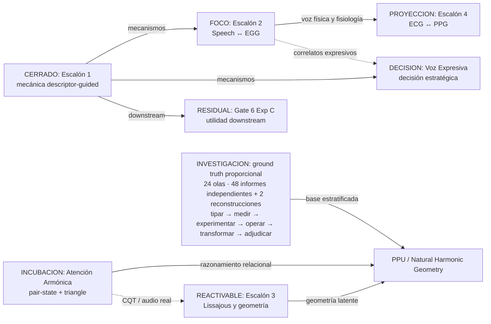

# Mapa visual del programa Phideus

## Leyenda

| Etiqueta | Estado |
|---|---|
| `FOCO` | foco activo |
| `RESIDUAL` | rama residual o decisión pendiente |
| `REACTIVABLE` | fase cerrada con punto de reentrada |
| `INCUBACION` | incubación arquitectónica |
| `CERRADO` | cerrado, superseded o histórico |
| `PROYECCION` | horizonte sin campaña activa |

## El programa de un vistazo

## Estado real de los frentes

| Frente | Qué ya sabemos | Qué queda vivo | Estado |
|---|---|---|---|
| Escalón 1 | La inyección descriptor-guided puede reorganizar causalmente la geometría latente | Sólo reutilización y downstream | Cerrado |
| Gate 6 Exp C | A4 no mejoró Transkun en Exp A/B | Decoder serio sobre features VICReg congeladas | Residual |
| Escalón 2 | P2 y P3 sostienen un null descriptor-guided | Diagnóstico representacional P2 vs P3 | Foco |
| Voz Expresiva | N-adapt transfiere EN↔ZH; N-strict no | Diagnosticar N-strict o pasar a habla naturalista | Decisión |
| Escalón 3 | P5-cqtshift es el mejor brazo OOD actual; P6 puro no gana | Replicación, activation o transferencia | Reactivable |
| Atención Armónica | Pair-state importa; triangle ayuda OOD-poly con clusterer global | Mejor estimación de k/partición o CQT | Incubación |
| Escalón 4 | Existe como hipótesis fisiológica | Falta diseño experimental | Proyección |

## Dos vías científicas y una capa contextual

| Vía | Unidad experimental | Pregunta | Frentes |
|---|---|---|---|
| Descriptores | Features proporcionales + mecanismo de inyección | ¿La proporción explícita reorganiza y transfiere? | E1, E2, Voz, Gate 6 |
| Arquitectura nativa | Geometrías, pares, operadores dinámicos, wiring y particiones | ¿La red puede razonar y componer proporcionalmente por construcción? | E3, Atención Armónica, PPU/NHG |
| Contexto agente | Wiki, memoria, relaciones entre evidencia y alternativas | ¿El conocimiento acumulado mejora la experimentación futura? | Capa metodológica transversal |
| Base de verdad | Invariantes, simuladores, cámaras, identificabilidad, certificados, medición, adquisición, mapas de escala, projectivity, tropicalidad, cocientes de forma, separación orbital, autoridad de filtración, conjuntos identificados y transformers set-valued | ¿Qué evidencia permite distinguir, medir, verificar o falsar una capacidad proporcional? | Investigación transversal PPU/NHG |

La tercera fila es una vía programática de trabajo, no evidencia científica ni
una afirmación ontológica sobre el mundo.

## Las bifurcaciones actuales

```mermaid
flowchart TD
    NOW["Estado actual"]
    NOW --> E2D["Cerrar diagnóstico P2 vs P3"]
    NOW --> G6C["Completar o cerrar Gate 6 Exp C"]
    NOW --> VED{"Voz: ¿diagnóstico o dominio naturalista?"}
    NOW --> AAD{"AA: ¿cabeza k/partición o CQT?"}
    NOW --> E3D{"E3: ¿replicación, activation o transferencia?"}
    NOW --> GTD{"PPU: ¿qué banco exacto prototipar primero?"}

    VED --> VE12["Fase 1.2 N-strict"]
    VED --> MSP["MSP-Podcast / habla naturalista"]
    AAD --> KB["Stage B: predecir k o partición"]
    AAD --> CQT["Fase 1a: render → CQT → picos"]
    E3D --> REP["Replicar mejor brazo"]
    E3D --> ACT["Activation arena"]
    E3D --> PHY["Transferencia física"]
    GTD --> P2K["P2k: ejecutar o descubrir coarse-graining"]
    GTD --> P5E["P5e: transferencia psicofísica controlada"]
    GTD --> P2L["P2l: ¿la razón es meaningful?"]
    GTD --> P2M["P2m: ¿la macrovariable preserva intervenciones?"]
    GTD --> P2N["P2n: ¿la familia conmuta entre cardinalidades?"]
    GTD --> P2O["P2o: ¿el dominio autoriza max-plus?"]
    GTD --> P2P["P2p: ¿la orientación y los menores son consistentes?"]
    GTD --> P2Q["P2q: ¿qué región de información tiene autoridad?"]
    GTD --> P2R["P2r: ¿puede ejecutar una contracción desde observación parcial?"]
    GTD --> P2S["P2s: ¿el scorer aditivo aporta sobre executor común?"]
    GTD --> P2T["P2t: ¿la distancia faltante es identificable y completable?"]
    GTD --> P2V["P2v: ¿el reader respeta correspondencia, SO/O y quiralidad?"]
    GTD --> R34["R34 bloqueado: ¿la tarea global sobrevive probes locales?"]
    GTD --> P2U["P2u: ¿los probes identifican la órbita de exchange?"]
    GTD --> P2AG["P2a-G: ¿el mixer aporta más allá del residual y el solver?"]
    GTD --> R36["R36 preflight: ¿closure separa órbitas sin inventar imagen?"]
    GTD --> R37["R37 audit: ¿invariante separa órbitas y conserva una gauge válida?"]
    GTD --> R38["R38 preflight: ¿la filtración y el reader autorizan la query?"]
    GTD --> R39["R39 audit: ¿el armónico separa órbitas bajo este sampling?"]
    GTD --> R40["R40 audit: ¿el estado preserva el futuro consultado bajo esta ley?"]
    GTD --> R41["R41 audit: ¿qué objeto espacial identifica el operador o la firma de difusión?"]
    GTD --> R42["R42 audit: ¿predice, cierra, identifica o controla el operador dinámico?"]
    R42 --> R43["R43/R44: ¿la respuesta identifica un punto, cociente, conjunto o UNKNOWN?"]
    R43 --> RQ["Response-Quotient Atlas<br/>candidata no promovida"]
    RQ --> R45["R45/R46: cociente ≠ orden informacional<br/>visibilidad = posición + dirección"]
    R45 --> ERG["Experiment-Relative Geometry Atlas<br/>candidata no promovida"]
    ERG --> R47["R47/R48: verdad parcial = conjunto compatible<br/>población ≠ aproximación ≠ inferencia"]
    R47 --> ISA["Identified-Set Authority Stack<br/>candidata no promovida"]
    ISA --> R49["R49/R50: transformar un set<br/>soundness ≠ precisión ≠ autoridad física"]
    R49 --> GST["Guaranteed Set Transformer Stack<br/>candidata no promovida · v0 no ejecutado"]
```

## Qué no está activo aunque parezca activo

| Línea | Por qué puede confundirse | Lectura correcta |
|---|---|---|
| Escalón 1 | Vive bajo `01_FRENTES_ACTIVOS/` | Tronco cerrado; Gate 6 Exp C es la excepción |
| EIR-EMR | Conserva README y roadmap propios | Antecedente superseded por Voz Expresiva |
| P6 toroidal | Tiene implementación y resultado | Hipótesis interesante, no ganadora en su receta actual |
| UOEMD/Rosetta | Conserva mucha documentación y código | Frente histórico cerrado |
| Roadmap Triplescaloneta v1.1 | Se presentaba como operativo | Esqueleto conceptual superado por la ejecución |

## Cómo navegar

- Para el contexto completo: [LLM_CONTEXT.md](LLM_CONTEXT.md).
- Para secuencia y dependencias: [current-portfolio.md](roadmaps/current-portfolio.md).
- Para cada frente: [index.md](index.md#frentes).
