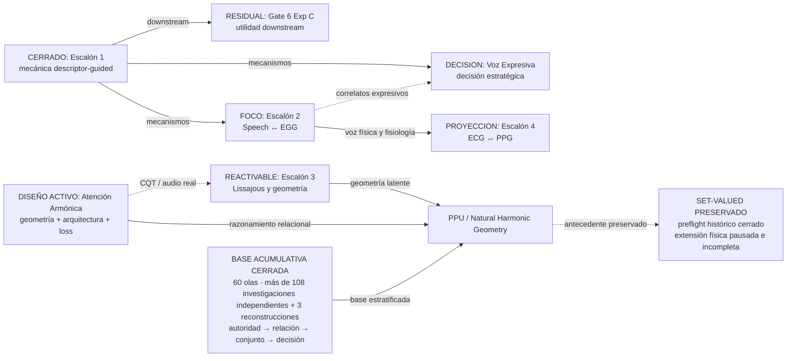

# Mapa visual del programa Phideus

El [ciclo geométrico vigente](../00_TRONCAL/ROADMAP_GENERAL/PROGRAMA_GEOMETRIA_ARMONICA_COMPUTABLE.md)
liga fenómeno, representación, arquitectura y pérdida. Atención Armónica es
su banco inicial; el [diagnóstico CPU](../../experiments/atencion_armonica/RESULTS_ENERGY_PARTITION_AUDIT.md)
ya mostró un canal de partición por amplitudes en la muestra histórica.
El [contraste neuronal completo](../../experiments/atencion_armonica/RESULTS_SHARED_PARTIAL_STUDY.md)
retiró amplitudes y cuestionó esta pérdida física frente a BCE. El
[diagnóstico de coherencia](../../experiments/atencion_armonica/RESULTS_SHARED_SOURCE_COHERENCE.md)
posterior separa ajuste de grupo y pertenencia. El
[lector estructurado ejecutado](../../experiments/atencion_armonica/RESULTS_SOURCE_STRUCTURED_READER.md)
completó cuatro tests frescos: sin ventaja clara del factor en polifonía,
con pérdida de ARI medio en otros dos shifts y auditorías de evidencia y alineación completas. La extensión
física set-valued está pausada e incompleta. Los diagramas del recorrido
proporcional conservan antecedentes, no una cola obligatoria de ejecución.
El [lector aprendido de particiones](../../experiments/atencion_armonica/PLAN_LEARNED_PARTITION_READER.md)
fue el contraste posterior; su [protocolo](../../experiments/atencion_armonica/PROTOCOL_LEARNED_PARTITION_READER.md)
está ejecutado: 36 trainings, cuatro tests y replays completos. Compartida
mejora el primario frente a Pares y Desacoplada, no claramente frente a Local,
y pierde frente a los tres bajo familia deformada. Las auditorías finales
cerraron sin hallazgos materiales abiertos. El [diagnóstico de rivales](../../experiments/atencion_armonica/RESULTS_OBSERVABLE_SOURCE_RIVALS.md)
completó 96 escenas y replays: ajuste de familia, cobertura e identidad no
son equivalentes. La continuidad debe aislar evidencia generativa con cabeza
y pérdida comunes, sin atribuir a geometría los priors del banco sintético.
El [contraste generativo](../../experiments/atencion_armonica/STATUS_GENERATIVE_EVIDENCE_READER.md)
completó la preparación y carga del corpus después de perfilar CPU/GPU y
almacenamiento. Los 27 entrenamientos y la selección por calibración están
completos; la auditoría confirmó época 50 para los tres brazos. La campaña
de tests se reanudó tras dos reparaciones de integración auditadas. La enmienda
JSON conserva las 512 escenas IID, sus features, tres forwards y el tiempo
consumido. IID, mayor inarmonicidad y polifonía completaron evaluación y replay;
familia deformada está pausada de forma recuperable por disponibilidad de
GPU. Faltan ese test y las auditorías finales.

## Leyenda

| Etiqueta | Estado |
|---|---|
| `FOCO` | foco activo |
| `RESIDUAL` | rama residual o decisión pendiente |
| `REACTIVABLE` | fase cerrada con punto de reentrada |
| `INCUBACION` | incubación arquitectónica |
| `CERRADO` | cerrado, superseded o histórico |
| `PROYECCION` | horizonte sin campaña activa |

## El programa de un vistazo

## Estado real de los frentes

| Frente | Qué ya sabemos | Qué queda vivo | Estado |
|---|---|---|---|
| Escalón 1 | La inyección descriptor-guided puede reorganizar causalmente la geometría latente | Sólo reutilización y downstream | Cerrado |
| Gate 6 Exp C | A4 no mejoró Transkun en Exp A/B | Decoder serio sobre features VICReg congeladas | Residual |
| Escalón 2 | P2 y P3 sostienen un null descriptor-guided | Diagnóstico representacional P2 vs P3 | Foco |
| Voz Expresiva | N-adapt transfiere EN↔ZH; N-strict no | Diagnosticar N-strict o pasar a habla naturalista | Decisión |
| Escalón 3 | P5-cqtshift es el mejor brazo OOD actual; P6 puro no gana | Replicación, activation o transferencia | Reactivable |
| Atención Armónica | Fuentes rivales: 96 escenas y replays; fases 0–0.6 preservadas | Ablación de evidencia generativa bajo cabeza/loss comunes | Ajuste, cobertura e identidad separados; sin promoción |
| PPU / geometría proporcional | Preflight set-valued histórico cerrado; extensión física incompleta | Corpus y mecanismos como evidencia del ciclo geométrico; no continuar envolvente por inercia | Extensión física pausada |
| Escalón 4 | Existe como hipótesis fisiológica | Falta diseño experimental | Proyección |

## Dos vías científicas y una capa contextual

| Vía | Unidad experimental | Pregunta | Frentes |
|---|---|---|---|
| Descriptores | Features proporcionales + mecanismo de inyección | ¿La proporción explícita reorganiza y transfiere? | E1, E2, Voz, Gate 6 |
| Arquitectura nativa | Geometrías, pares, operadores dinámicos, wiring y particiones | ¿La red puede razonar y componer proporcionalmente por construcción? | E3, Atención Armónica, PPU/NHG |
| Contexto agente | Wiki, memoria, relaciones entre evidencia y alternativas | ¿El conocimiento acumulado mejora la experimentación futura? | Capa metodológica transversal |
| Base de verdad | Invariantes, simuladores, cámaras, identificabilidad, certificados, lineage, artefactos pre/post-checker, medición, adquisición, cocientes, conjuntos identificados y abstención tipada | ¿Qué evidencia permite distinguir, atribuir, verificar o falsar una capacidad proporcional sin que el pipeline se otorgue su propio crédito? | Investigación transversal PPU/NHG |

La tercera fila es una vía programática de trabajo, no evidencia científica ni
una afirmación ontológica sobre el mundo.

## Las bifurcaciones actuales

```mermaid
flowchart TD
    NOW["Estado actual"]
    NOW --> E2D["Cerrar diagnóstico P2 vs P3"]
    NOW --> G6C["Completar o cerrar Gate 6 Exp C"]
    NOW --> VED{"Voz: ¿diagnóstico o dominio naturalista?"}
    NOW --> GEO["Preflight de compatibilidad completo<br/>runner y medición GPU antes de training"]
    GEO -.-> AAD{"Alternativas AA preservadas"}
    NOW --> E3D{"E3: ¿replicación, activation o transferencia?"}
    NOW --> GTD{"PPU: ¿la composición proporcional explícita aporta?"}

    VED --> VE12["Fase 1.2 N-strict"]
    VED --> MSP["MSP-Podcast / habla naturalista"]
    AAD --> KB["Stage B: predecir k o partición"]
    AAD --> CQT["Fase 1a: render → CQT → picos"]
    E3D --> REP["Replicar mejor brazo"]
    E3D --> ACT["Activation arena"]
    E3D --> PHY["Transferencia física"]
    GTD --> NCP0["EJECUTADO: contrato anti-leakage<br/>+ WLS/IRLS · 256 masters"]
    GTD --> NCP1["EJECUTADO: smoke factorial<br/>evidencia × mixer × solver"]
    GTD --> W57["EJECUTADO: Olas 56–57<br/>contexto → proposer + guard<br/>patrón final indeterminado"]
    W57 --> W58["DIAGNÓSTICO ABIERTO: Ola 58<br/>HGB/HGB incompatibility ↔ harm<br/>19 firmas · sin promoción"]
    W58 --> W59["EJECUTADO FRESCO: Ola 59<br/>patrones 7/8 y 6/8 · falsos<br/>controles matched no separados"]
    W59 --> W60["TRANSPORTE CONGELADO: Ola 60<br/>ocho métricas vs hard favorables<br/>controles matched no separados"]
    W60 --> MAP["EJECUTADO: MAPPING-FEASIBILITY<br/>factorial común no factible<br/>dos contrastes nativos"]
    MAP --> REL["FREEZE RECHAZADO: relacional<br/>K192 no aproxima executor canónico"]
    MAP --> SET["EJECUTADO: runner CPU pre-draw<br/>marginal/joint × hard/contextual"]
    SET -.-> PACK["PAUSADO E INCOMPLETO: extensión física<br/>no es el siguiente paso obligatorio"]
    NCP1 --> NCP2["EJECUTADO: relación cruda/corregida<br/>× peso unidad/aprendido × solver"]
    NCP2 --> NCP3["EJECUTADO: interfaz estática + temperatura<br/>shuffle espacial + router público"]
    NCP3 --> NCP4["EJECUTADO: adapters head-only<br/>positivo IID WLS · negativo IRLS"]
    NCP4 --> NCP5["EJECUTADO: surrogate IRLS K=64<br/>valores + gradientes conformes"]
    NCP5 --> NCP6["EJECUTADO: pérdida post-IRLS<br/>mejor que local · pierde IID"]
    NCP6 --> NCP7["EJECUTADO: gate residual público<br/>positivo grouped · no favorable IID"]
    NCP7 --> NCP8["EJECUTADO: calibración IID/grouped<br/>+ adjudicación fresca · 251+251 masters"]
    NCP8 --> NCP9["EJECUTADO: abstención bajo no-daño<br/>safe = identidad · grouped se conserva fuera"]
    NCP9 --> NCP10["EJECUTADO: potencia + transporte<br/>IID inestable · grouped persiste"]
    NCP10 --> NCP11["EJECUTADO: gate topológico<br/>supera base + sham · safe identidad"]
    NCP11 --> NCP12["EJECUTADO: riesgo condicional<br/>acción casi nula · sin ventaja"]
    NCP12 --> NCP13["EJECUTADO POST HOC: cola firmada<br/>mejor OOF · acción 24/2.032"]
    NCP13 --> NCP14["EJECUTADO FRESCO: signed vs absolute<br/>OOF transporta · acción 5 vs 2"]
    NCP14 --> NCP15["EJECUTADO POST HOC: selected-action<br/>acción 14/2.040 · sin atribución"]
    NCP15 --> NCP16["EJECUTADO: transporte + potencia<br/>7/12 signos inestables · N≫250"]
    NCP16 --> NCP17["EJECUTADO: alpha compartido<br/>ranking con presupuesto igualado"]
    NCP17 --> NCP18["EJECUTADO: mean-only<br/>gana 50/72 · cola gana 2/72"]
    NCP18 --> NCP19["EJECUTADO: two-stage<br/>cola sobreabstiene · sin atribución"]
    NCP19 --> NCP20["EJECUTADO: atribución de mu<br/>topology rankea · firewall no transporta"]
    NCP20 --> NCP21["EJECUTADO: potencia + selección<br/>N min 522 · firewall elimina 26/37"]
    NCP21 --> NCP22["EJECUTADO: frente Pareto<br/>retención 0,771 · Jaccard A/B 0,542"]
    NCP22 --> NCP23["EJECUTADO: dominancia pareada<br/>20→40 no dominado · estado inestable"]
    NCP23 --> NCP24["EJECUTADO: interfaz BudgetPath<br/>608/608 válidos · utilidad ausente"]
    NCP24 --> NCP25["EJECUTADO: puerto de utilidad<br/>7/7 · 3/3 · 12/12 · histórico 0"]
    NCP25 --> NCP26["DECISION: utilidad auténtica + freeze<br/>sin fabricar preferencia · GPU sólo tras aviso y habilitación explícita"]
    NCP26 --> TRANS["Transferir primitive sin redefinirla"]
    GTD --> P2N["P2n: ¿la familia conmuta entre cardinalidades?"]
    GTD --> P2O["P2o: ¿el dominio autoriza max-plus?"]
    GTD --> P2P["P2p: ¿la orientación y los menores son consistentes?"]
    GTD --> P2Q["P2q: ¿qué región de información tiene autoridad?"]
    GTD --> P2R["P2r: ¿puede ejecutar una contracción desde observación parcial?"]
    GTD --> P2S["P2s: ¿el scorer aditivo aporta sobre executor común?"]
    GTD --> P2T["P2t: ¿la distancia faltante es identificable y completable?"]
    GTD --> P2V["P2v: ¿el reader respeta correspondencia, SO/O y quiralidad?"]
    GTD --> R34["R34 bloqueado: ¿la tarea global sobrevive probes locales?"]
    GTD --> P2U["P2u: ¿los probes identifican la órbita de exchange?"]
    GTD --> P2AG["P2a-G: ¿el mixer aporta más allá del residual y el solver?"]
    GTD --> R36["R36 preflight: ¿closure separa órbitas sin inventar imagen?"]
    GTD --> R37["R37 audit: ¿invariante separa órbitas y conserva una gauge válida?"]
    GTD --> R38["R38 preflight: ¿la filtración y el reader autorizan la query?"]
    GTD --> R39["R39 audit: ¿el armónico separa órbitas bajo este sampling?"]
    GTD --> R40["R40 audit: ¿el estado preserva el futuro consultado bajo esta ley?"]
    GTD --> R41["R41 audit: ¿qué objeto espacial identifica el operador o la firma de difusión?"]
    GTD --> R42["R42 audit: ¿predice, cierra, identifica o controla el operador dinámico?"]
    R42 --> R43["R43/R44: ¿la respuesta identifica un punto, cociente, conjunto o UNKNOWN?"]
    R43 --> RQ["Response-Quotient Atlas<br/>candidata no promovida"]
    RQ --> R45["R45/R46: cociente ≠ orden informacional<br/>visibilidad = posición + dirección"]
    R45 --> ERG["Experiment-Relative Geometry Atlas<br/>candidata no promovida"]
    ERG --> R47["R47/R48: verdad parcial = conjunto compatible<br/>población ≠ aproximación ≠ inferencia"]
    R47 --> ISA["Identified-Set Authority Stack<br/>candidata no promovida"]
    ISA --> R49["R49/R50: transformar un set<br/>soundness ≠ precisión ≠ autoridad física"]
    R49 --> GST["Guaranteed Set Transformer Stack<br/>candidata no promovida · v0 no ejecutado"]
    GTD --> H41["H41-X1: Clifford tipado vs tensor exacto<br/>+ equivariant / attention / tensor products"]
    GTD --> H44["H44-A–F: lineage + firewall de crédito<br/>status/set/policy + harness externo"]
    H44 --> W45["Ola 45: piezas públicas materializadas<br/>sin bundle tricarril · sin selección"]
    W45 --> W46["Ola 46: cinco blueprints prospectivos<br/>harness tipado · sin stack seleccionado"]
    W46 --> W47["Ola 47: autoridad material tipada<br/>target autorizado ≠ relación proporcional autorizada"]
    W47 --> W48["Ola 48: autoridad de la relación<br/>material · meaningfulness · régimen · discriminación"]
```

## Qué no está activo aunque parezca activo

| Línea | Por qué puede confundirse | Lectura correcta |
|---|---|---|
| Escalón 1 | Vive bajo `01_FRENTES_ACTIVOS/` | Tronco cerrado; Gate 6 Exp C es la excepción |
| EIR-EMR | Conserva README y roadmap propios | Antecedente superseded por Voz Expresiva |
| P6 toroidal | Tiene implementación y resultado | Hipótesis interesante, no ganadora en su receta actual |
| UOEMD/Rosetta | Conserva mucha documentación y código | Frente histórico cerrado |
| Roadmap Triplescaloneta v1.1 | Se presentaba como operativo | Esqueleto conceptual superado por la ejecución |

## Cómo navegar

- Para el contexto completo: [LLM_CONTEXT.md](LLM_CONTEXT.md).
- Para secuencia y dependencias: [current-portfolio.md](roadmaps/current-portfolio.md).
- Para cada frente: [index.md](index.md#frentes).
