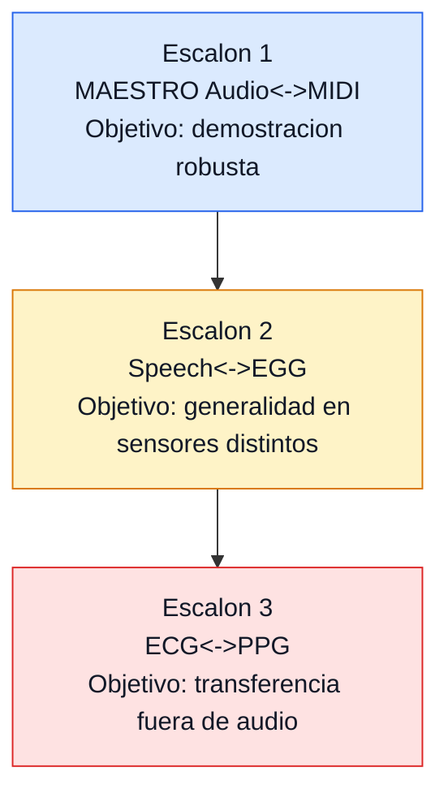

<div align="center">

# Phideus v5.0
### Harmonic Information Theory Research


</div>

> [!IMPORTANT]
> **Estado**: programa de investigacion activo  
> **Ultima actualizacion**: 2026-02-10  
> **Foco actual**: `BIAS_CONTROL` (Escalon 1-C: Gate 4 + Gate 6)

---

## Navegacion Rapida

- [Resumen](#resumen)
- [Lineas Experimentales](#lineas-experimentales-del-proyecto)
- [Plan Operativo BIAS_CONTROL](#plan-operativo-bias_control-escalon-1-c)
- [Proyeccion TripleScaloneta](#proyeccion-triplescaloneta)
- [Concepto Central](#concepto-central)
- [Hallazgos Principales](#hallazgos-principales)
- [Estructura del Repositorio](#estructura-del-repositorio)
- [Quick Start](#quick-start)
- [Documentacion](#documentacion)
- [Hipotesis de Investigacion](#hipotesis-de-investigacion)
- [Arquitectura BIAS_CONTROL](#arquitectura-bias_control-resumen)

---

## Resumen

Phideus investiga si las **relaciones armonicas (ratios de frecuencia)** pueden funcionar como un lenguaje fisico transferible entre modalidades.

La linea principal hoy es **audio <-> MIDI** sobre MAESTRO, con entrenamiento contrastivo y evaluaciones estructuradas para retrieval cross-modal en escenarios dificiles (`hard negatives`).

### Estado de Hipotesis (Febrero 2026)

| Hipotesis | Estado | Evidencia actual |
|-----------|--------|------------------|
| **H1: Estructura** | VALIDADA | Distribuciones de ratios no aleatorias en multiples contextos |
| **H2: Aprendibilidad** | VALIDADA | VAE/HRM con `val_loss < 0.5` en representaciones de ratios |
| **H3: Cross-modality** | PROMETEDOR | `BIAS_CONTROL` (Gate 2) con gap robusto y buen `hard_neg_acc` |

### Experimento Actual: BIAS_CONTROL (Escalon 1)


#### Controles de navegacion por gate

- [Gate 0 - Data Integrity](#gate-0---data-integrity)
- [Gate 1 - Intra-modal Baselines](#gate-1---intra-modal-baselines)
- [Gate 2 - Foundation Baseline](#gate-2---foundation-baseline)
- [Gate 2.5 - Embedding Diagnostics](#gate-25---embedding-diagnostics)
- [Gate 3 - DANN](#gate-3---dann-cerrado)
- [Gate 4 - Ratio Auxiliary](#gate-4---ratio-auxiliary-en-curso)
- [Gate 5 - Curriculum](#gate-5---curriculum-opcional)
- [Gate 6 - Retroanalysis](#gate-6---retroanalysis-pendiente)

#### Matriz de control (estado actual)

| Gate | Rol en el roadmap | Estado | Decision |
|------|--------------------|--------|----------|
| Gate 0 | Integridad de datos y alineacion | Completado | GO |
| Gate 1 | Baselines intra-modales | Completado | GO |
| **Gate 2** | Baseline cross-modal principal | **Completado** | **GO (checkpoint de referencia)** |
| Gate 2.5 | Diagnostico de separabilidad | Completado | GO (diagnostico, no objetivo final) |
| **Gate 3 (DANN)** | Prueba de invariancia modal | **Cerrado** | **NO-GO (sin mejora robusta)** |
| **Gate 4 (Ratio Auxiliary)** | Test causal de señal de ratios | **En curso** | Pendiente Run A vs Run B |
| Gate 5 | Curriculum/extensiones | Hold | Opcional |
| Gate 6 | Retroanalisis representacional | Pendiente | Requerido para cierre Escalon 1-C |

Metricas clave del baseline actual (Gate 2, `checkpoint_epoch45`):

| Metrica | Valor |
|---------|-------|
| Gap (aligned - random) | **0.478** |
| Recall@10 structured pool (a2m) | **34.4%** |
| Recall@10 structured pool (m2a) | **37.6%** |
| Hard Negative Accuracy | **80.4%** |

---

## Lineas Experimentales del Proyecto

Phideus hoy opera con dos enfoques que se complementan:

| Enfoque | Objetivo | Hallazgo principal | Estado |
|---------|----------|-------------------|--------|
| **Pre-analisis (hashing/ratios)** | Medir si la estructura de ratios contiene señal discriminativa antes de modelos grandes | Señal real detectada (`vs random 5.4x`), pero rendimiento insuficiente para cierre fuerte en setup historico | Pausado como linea principal |
| **BIAS_CONTROL (cross-modal contrastivo)** | Validar alineacion Audio<->MIDI robusta con control de sesgo | Gate 2 estable y fuerte; Gate 3 negativo informativo; Gate 4/6 en curso para cierre causal+explicativo | Linea principal activa |

### Experimentos ya realizados (resumen corto)

| Bloque | Resultado | Lectura |
|--------|-----------|---------|
| Escalon 1 hashing historico | Piece accuracy 27% (insuficiente) | Util como señal inicial, no como cierre |
| UOEMD revisionismo (F0-F3A) | NO-GO para escalar H3 | Confirmo limites del regimen y del tokenizado |
| BIAS_CONTROL Gate 2 | Gap 0.478, R@10 a2m 34.4%, hard neg 80.4% | Baseline operativo actual |
| BIAS_CONTROL Gate 3 (DANN) | 4 runs, sin mejora robusta sobre Gate 2 | Invariancia modal no era cuello principal |
| BIAS_CONTROL Gate 4 smoke | Entrena + eval correctos con hardening aplicado | Listo para comparacion larga A/B |

---

## Plan Operativo BIAS_CONTROL (Escalon 1-C)

> [!IMPORTANT]
> En esta fase se cierra el Escalon 1 con dos piezas:  
> **Gate 4** (evidencia causal de ratios) + **Gate 6** (evidencia explicativa de embeddings).

<a id="gate-0---data-integrity"></a>
### Gate 0 - Data Integrity
- **Objetivo**: validar pares Audio<->MIDI, splits y consistencia de metadata.
- **Criterio de decision**: GO si no hay fallas sistemicas de alineacion/datos.
- **Estado**: completado.
- **Artefactos**: `experiments/bias_control/gate0_data_integrity.py`.

<a id="gate-1---intra-modal-baselines"></a>
### Gate 1 - Intra-modal Baselines
- **Objetivo**: establecer piso intra-modal para controlar regresiones.
- **Criterio de decision**: GO si baseline intra-modal es estable y util para monitoreo.
- **Estado**: completado.
- **Artefactos**: `experiments/bias_control/gate1_intra_modal.py`.

<a id="gate-2---foundation-baseline"></a>
### Gate 2 - Foundation Baseline
- **Objetivo**: baseline cross-modal con entrenamiento contrastivo/VICReg.
- **Decision actual**: **checkpoint de referencia** `checkpoint_epoch45`.
- **Resultado clave**: `Gap=0.478`, `R@10 a2m=34.4%`, `R@10 m2a=37.6%`, `hard_neg=80.4%`.
- **Artefactos**: `experiments/bias_control/gate2_foundation.py`.

<a id="gate-25---embedding-diagnostics"></a>
### Gate 2.5 - Embedding Diagnostics
- **Objetivo**: inspeccionar separabilidad modal y salud del embedding.
- **Resultado clave**: separabilidad alta (92.7%), util como diagnostico.
- **Lectura correcta**: no usar este gate como criterio unico para redisenar el pipeline.

<a id="gate-3---dann-cerrado"></a>
### Gate 3 - DANN (cerrado)
- **Objetivo**: forzar invariancia modal y medir impacto causal en retrieval.
- **Resultado**: cerrado por no superar de forma robusta al Gate 2 en structured pool.
- **Conclusión tecnica**: la separabilidad modal no era el factor limitante principal.
- **Artefactos**: `experiments/bias_control/gate3_dann.py`, `Documents/BIAS_CONTROL/Gate3_DANN_Results/INFORME_GATE3_COMPLETO.md`.

<a id="gate-4---ratio-auxiliary-en-curso"></a>
### Gate 4 - Ratio Auxiliary (en curso)
- **Hipotesis**: una vista auxiliar de ratios puede mejorar retrieval sin destruir señal principal.
- **Diseno causal obligatorio**:
  - **Run A**: `ratio_weight=0.1` (tratamiento)
  - **Run B**: `ratio_weight=0.0` (control)
  - Regimen homogeneo: `max-batches-per-epoch=1000`, `max-val-batches=846`, `seed=42`.
- **Metrica canonica de decision**: `structured pool` (pool 256, 500 queries, seed 42).
- **Estado**: en ejecucion.
- **Artefactos**: `experiments/bias_control/gate4_ratio_auxiliary.py`.

<a id="gate-5---curriculum-opcional"></a>
### Gate 5 - Curriculum (opcional)
- **Rol**: posible optimizacion adicional si Gate 4/6 no cierran hipótesis.
- **Estado**: hold.
- **Politica**: no bloquea cierre de Escalon 1-C.

<a id="gate-6---retroanalysis-pendiente"></a>
### Gate 6 - Retroanalysis (pendiente)
- **Objetivo**: explicar *que* aprendio el embedding y *donde* impacta ratios.
- **Analisis esperados**: RSA/CKA, probes, disagreement analysis, inspeccion de hard negatives.
- **Rol**: requisito para cierre explicativo del Escalon 1.

---

## Proyeccion TripleScaloneta



| Escalon | Dominio | Estado | Criterio de avance |
|---------|---------|--------|--------------------|
| **1** | MAESTRO Audio<->MIDI | **Activo (1-C en curso)** | Cerrar Gate 4 + Gate 6 + auditoria final |
| 2 | Speech<->EGG | Planificado | Iniciar solo con cierre robusto del Escalon 1 |
| 3 | ECG<->PPG | Proyeccion | Iniciar luego de evidencia de generalidad en Escalon 2 |

---

## Concepto Central

Los paisajes sonoros contienen relaciones de frecuencia significativas (por ejemplo `3:2`, `5:4` y otras proporciones estables). Phideus intenta capturar esa estructura sin depender de codificaciones musicales ad hoc.

> [!NOTE]
> **Hipotesis central**: los ratios armonicos son unidades fisicas de informacion con poder de transferencia entre modalidades.

---

## Hallazgos Principales

| Hito | Resultado | Significado |
|------|-----------|-------------|
| **BIAS_CONTROL Gate 2** | Gap 0.478 + buen hard negatives | Primera señal fuerte de alineacion cross-modal util |
| **Gate 3 (DANN)** | 4 runs sin mejora estable sobre Gate 2 | La separabilidad modal alta no era el cuello de botella principal |
| **Analizador 5.0** | VAE ~ HRM (`val_loss` similar) | La representacion pesa mas que la arquitectura en ese regimen |
| **Extractor v2.2** | Gap pre-red alto en condiciones controladas | Los histogramas de ratios contienen senal discriminativa |
| **UOEMD revisionismo** | NO-GO para escalar H3 | Dataset pequeno/regimen insuficiente para cierre fuerte |

### Descubrimientos metodologicos relevantes

1. **La metrica canonica de decision debe ser structured pool**, no solo metricas globales de validacion.
2. **Forzar invariancia (DANN) puede destruir senal de retrieval** si la hipotesis causal no esta bien acotada.
3. **Comparabilidad de regimen** (`pool`, `seed`, `batch budget`) es critica para no tomar decisiones falsas.

---

## Estructura del Repositorio

```text
Phideus/
├── src/
│   ├── analizador/
│   │   ├── analizador_5.0.py
│   │   ├── analizador_roseta.py
│   │   └── ...
│   ├── bias_control/
│   │   ├── architectures/
│   │   ├── datasets/
│   │   ├── encoders/
│   │   └── losses/
│   ├── extractors/
│   ├── RNA/
│   └── hrm/
│
├── experiments/
│   └── bias_control/
│       ├── gate0_data_integrity.py
│       ├── gate1_intra_modal.py
│       ├── gate2_foundation.py
│       ├── gate3_dann.py
│       ├── gate4_ratio_auxiliary.py
│       └── evaluate_structured_pool.py
│
├── Documents/
│   ├── INDICE_DOCUMENTACION.md
│   ├── Proyecto_Estado_Actual.md
│   ├── BIAS_CONTROL/
│   ├── ESCALON_1/
│   └── UOEMD/
│
├── config/
├── requirements.txt
└── README.md
```

> [!TIP]
> `data/`, `models/`, `train/`, `test/` y otros artefactos pesados no se versionan.

---

## Quick Start

### 1) Configurar entorno

```bash
python3 -m venv venv
source venv/bin/activate
pip install -r requirements.txt
```

### 2) Pipeline completo (referencia)

```bash
python experiments/bias_control/run_all_gates.py \
  --maestro-dir data/maestro_v3/maestro-v3.0.0 \
  --output data/bias_control_medium
```

<details>
<summary><strong>3) Gate 4 - Comandos operativos (Run A / Run B / structured pool)</strong></summary>

<br>

**Run A (ratio activo)**

```bash
python experiments/bias_control/gate4_ratio_auxiliary.py \
  --maestro-dir data/maestro_v3/maestro-v3.0.0 \
  --checkpoint data/bias_control_medium/training_outputs/gate2/checkpoint_epoch45.pt \
  --output data/bias_control_medium/training_outputs/gate4_runA \
  --epochs 30 --ratio-weight 0.1 \
  --batch-size 16 --segment-len 4.0 --hop 1.0 --num-workers 8 \
  --max-batches-per-epoch 1000 --max-val-batches 846 \
  --seed 42 --device cuda
```

**Run B (control causal)**

```bash
python experiments/bias_control/gate4_ratio_auxiliary.py \
  --maestro-dir data/maestro_v3/maestro-v3.0.0 \
  --checkpoint data/bias_control_medium/training_outputs/gate2/checkpoint_epoch45.pt \
  --output data/bias_control_medium/training_outputs/gate4_runB \
  --epochs 30 --ratio-weight 0.0 \
  --batch-size 16 --segment-len 4.0 --hop 1.0 --num-workers 8 \
  --max-batches-per-epoch 1000 --max-val-batches 846 \
  --seed 42 --device cuda
```

**Structured pool evaluation**

```bash
python experiments/bias_control/evaluate_structured_pool.py \
  --model data/bias_control_medium/training_outputs/gate4_runA/best_model_base.pt \
  --maestro-dir data/maestro_v3/maestro-v3.0.0 \
  --pool-size 256 --n-queries 500 --seed 42 --device cuda
```

</details>

---

## Documentacion

### Documentos Principales

| Documento | Descripcion |
|-----------|-------------|
| [Documents/INDICE_DOCUMENTACION.md](Documents/INDICE_DOCUMENTACION.md) | Mapa actualizado de documentacion |
| [Documents/Proyecto_Estado_Actual.md](Documents/Proyecto_Estado_Actual.md) | Estado ejecutivo del proyecto |
| [Documents/Rosetta_triplescaloneta.md](Documents/Rosetta_triplescaloneta.md) | Proyeccion por escalones y criterios de avance |
| [Documents/INFORME_HISTORICO_REPRESENTACIONES_RATIOS.md](Documents/INFORME_HISTORICO_REPRESENTACIONES_RATIOS.md) | Historia tecnica de representaciones |

### BIAS_CONTROL

| Documento | Descripcion |
|-----------|-------------|
| [Documents/BIAS_CONTROL/ROADMAP_BIAS_CONTROL.md](Documents/BIAS_CONTROL/ROADMAP_BIAS_CONTROL.md) | Plan maestro y criterios de decision |
| [Documents/BIAS_CONTROL/INFORME_GATE2_COMPLETO.md](Documents/BIAS_CONTROL/INFORME_GATE2_COMPLETO.md) | Informe tecnico de Gate 2 |
| [Documents/BIAS_CONTROL/Gate3_DANN_Results/INFORME_GATE3_COMPLETO.md](Documents/BIAS_CONTROL/Gate3_DANN_Results/INFORME_GATE3_COMPLETO.md) | Cierre tecnico de Gate 3 |
| [Documents/BIAS_CONTROL/AUDITORIA_BIAS_CONTROL_CODEX.md](Documents/BIAS_CONTROL/AUDITORIA_BIAS_CONTROL_CODEX.md) | Auditoria v1 y addendum operativo |
| [Documents/BIAS_CONTROL/Planes_Claude/plan_gate4.md](Documents/BIAS_CONTROL/Planes_Claude/plan_gate4.md) | Plan operativo Gate 4 |
| [Documents/BIAS_CONTROL/Planes_Claude/plan_gate4_codex.md](Documents/BIAS_CONTROL/Planes_Claude/plan_gate4_codex.md) | Revision tecnica de Gate 4 |

### Otros frentes

| Frente | Documento | Estado |
|--------|-----------|--------|
| Escalon 1 (hashing historico) | [Documents/ESCALON_1/Plan_implementacion.md](Documents/ESCALON_1/Plan_implementacion.md) | Pausado |
| UOEMD revisionismo | [Documents/UOEMD/UOEMD_Revisionismo/ROADMAP.md](Documents/UOEMD/UOEMD_Revisionismo/ROADMAP.md) | No-go |

---

## Hipotesis de Investigacion

### H1: Estructura de Ratios (validada)
Las senales naturales muestran distribuciones de ratios no triviales y estables.

### H2: Aprendibilidad (validada)
Modelos neuronales pueden aprender representaciones compactas de esa estructura.

### H3: Cross-modality (en validacion)
La evidencia actual muestra alineacion util en retrieval audio<->MIDI, pero el cierre fuerte depende de completar Gate 4 (A/B) y Gate 6.

---

## Arquitectura BIAS_CONTROL (resumen)

### Baseline (Gate 2)

```text
Audio (waveform) -> MERT encoder -> Projection -> Embedding (256d)
MIDI  (tokens)   -> MIDI encoder -> Projection -> Embedding (256d)
                             \    VICReg + retrieval objectives
```

### Extension actual (Gate 4)

```text
Audio embedding <-> MIDI embedding  (loss principal)
       \             /
        \           /
         Ratio auxiliary branch (MLP sobre histogramas)

Comparacion causal: Run A (ratio_weight=0.1) vs Run B (ratio_weight=0.0)
```

---

## Licencia

MIT License. Ver [LICENSE.md](LICENSE.md).

---

> "El bosque ya canta. Nuestra tarea es entender su afinacion."
