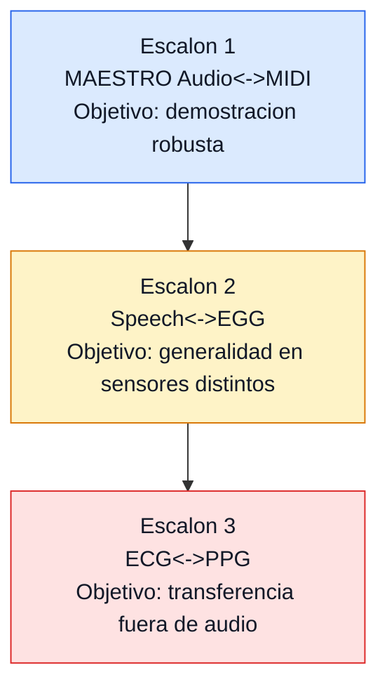

<div align="center">

# Phideus v5.0
### Harmonic Information Theory Research


</div>

> [!IMPORTANT]
> **Estado**: programa de investigacion activo  
> **Ultima actualizacion**: 2026-02-14  
> **Foco actual**: `BIAS_CONTROL` (Escalon 1-C: diagnostico post Gate 4.1 completado + Bloque A v1.1 cerrado con `Run D-02` completado (30 epocas), best `epoch25` `S=61.8%`, `A2M=61.8%`, `M2A=62.4%`, `hard_neg=90.4%`; lock formal en `foundation_locked_e25.pt`; Gate 4.2 cerrado con `D4 8ep` (`S_best=64.2%`, `hard_neg_best=91.6%`) y Gate 4.3 en arranque por pilotos `a4/a7/d4a4/d4a7`)  
> **Linea de infraestructura**: `VibeTensor` en pausa hasta cerrar Bloque A del plan post-diagnostico

---

## Navegacion Rapida

- [Resumen](#resumen)
- [Lineas Experimentales](#lineas-experimentales-del-proyecto)
- [Optimizacion Runtime](#optimizacion-runtime-vibetensor-spike)
- [Plan Operativo BIAS_CONTROL](#plan-operativo-bias_control-escalon-1-c)
- [Proyeccion TripleScaloneta](#proyeccion-triplescaloneta)
- [Concepto Central](#concepto-central)
- [Hallazgos Principales](#hallazgos-principales)
- [Estructura del Repositorio](#estructura-del-repositorio)
- [Quick Start](#quick-start)
- [Documentacion](#documentacion)
- [Hipotesis de Investigacion](#hipotesis-de-investigacion)
- [Arquitectura BIAS_CONTROL](#arquitectura-bias_control-resumen)

---

## Visualizaciones Interactivas de Arquitectura

Exploraciones 3D interactivas de las redes neuronales del proyecto:
**[altermundi.github.io/Phideus](https://altermundi.github.io/Phideus/)**

| Visualizacion | Descripcion |
|---------------|-------------|
| [Phideus / Run D](https://altermundi.github.io/Phideus/phideus) | Arquitectura cross-modal Audio+MIDI (foundation) |
| [BloqueA / Run C](https://altermundi.github.io/Phideus/bloquea) | Arquitectura hibrida con adapters |
| [RosetaVAE](https://altermundi.github.io/Phideus/roseta) | VAE dual-domain Audio-Vibracion |

> Reconocimiento: esta linea de visualizacion fue adaptada sobre el trabajo original de Brendan Bycroft.
> Repo original: [bbycroft/llm-viz](https://github.com/bbycroft/llm-viz) (MIT).

---

## Resumen

Phideus investiga si las **relaciones armonicas (ratios de frecuencia)** pueden funcionar como un lenguaje fisico transferible entre modalidades.

La linea principal hoy es **audio <-> MIDI** sobre MAESTRO, con entrenamiento contrastivo y evaluaciones estructuradas para retrieval cross-modal en escenarios dificiles (`hard negatives`).

### Estado de Hipotesis (Febrero 2026)

| Hipotesis | Estado | Evidencia actual |
|-----------|--------|------------------|
| **H1: Estructura** | VALIDADA | Distribuciones de ratios no aleatorias en multiples contextos |
| **H2: Aprendibilidad** | VALIDADA | VAE/HRM con `val_loss < 0.5` en representaciones de ratios |
| **H3: Cross-modality** | PROMETEDOR | `BIAS_CONTROL` (Gate 2) con gap robusto y buen `hard_neg_acc` |

### Experimento Actual: BIAS_CONTROL (Escalon 1)

```mermaid
flowchart LR
  G0["Gate 0<br/>Data Integrity"] --> G1["Gate 1<br/>Intra-modal Baselines"]
  G1 --> G2["Gate 2<br/>Foundation Baseline"]
  G2 --> G25["Gate 2.5<br/>Separability Probe"]
  G25 --> G3["Gate 3<br/>DANN"]
  G3 --> G4["Gate 4<br/>Ratio Auxiliary Base"]
  G4 --> G41["Gate 4.1<br/>Causal Matrix DEC-004/004-A"]
  G41 --> G6["Gate 6<br/>Retroanalysis (completado)"]
  G6 --> G42["Gate 4.2<br/>Pre-red dual-domain (completado)"]
  G42 --> BA["Bloque A v1.1<br/>S0 / A / B / C / D"]
  BA --> G5["Gate 5<br/>Optional"]

  style G2 fill:#dcfce7,stroke:#16a34a,color:#111827
  style G3 fill:#fee2e2,stroke:#dc2626,color:#111827
  style G4 fill:#dbeafe,stroke:#2563eb,color:#111827
  style G41 fill:#e5e7eb,stroke:#6b7280,color:#111827
  style G6 fill:#dcfce7,stroke:#16a34a,color:#111827
  style G42 fill:#dcfce7,stroke:#16a34a,color:#111827
  style BA fill:#fef3c7,stroke:#d97706,color:#111827
```



#### Controles de navegacion por gate

- [Gate 0 - Data Integrity](#gate-0---data-integrity)
- [Gate 1 - Intra-modal Baselines](#gate-1---intra-modal-baselines)
- [Gate 2 - Foundation Baseline](#gate-2---foundation-baseline)
- [Gate 2.5 - Embedding Diagnostics](#gate-25---embedding-diagnostics)
- [Gate 3 - DANN](#gate-3---dann-cerrado)
- [Gate 4 - Ratio Auxiliary](#gate-4---ratio-auxiliary-base-completado)
- [Gate 4.1 - Matriz Causal](#gate-41---matriz-causal-dec-004004-a-cerrado)
- [Gate 4.2 - Diagnóstico Dual-Domain](#gate-42---dual-domain-ratios-diagnostico-dec-005)
- [Bloque A v1.1 - Recuperación Post-Diagnóstico](#bloque-a-v11---recuperación-post-diagnóstico)
- [Gate 5 - Curriculum](#gate-5---curriculum-opcional)
- [Gate 6 - Retroanalysis](#gate-6---retroanalysis-diagnostico-aprobado)

#### Matriz de control (estado actual)

| Gate | Rol en el roadmap | Estado | Decision |
|------|--------------------|--------|----------|
| Gate 0 | Integridad de datos y alineacion | Completado | GO |
| Gate 1 | Baselines intra-modales | Completado | GO |
| **Gate 2** | Baseline cross-modal principal | **Completado** | **GO (checkpoint de referencia)** |
| Gate 2.5 | Diagnostico de separabilidad | Completado | GO (diagnostico, no objetivo final) |
| **Gate 3 (DANN)** | Prueba de invariancia modal | **Cerrado** | **NO-GO (sin mejora robusta)** |
| **Gate 4 (Ratio Auxiliary base)** | Test inicial de señal de ratios | **Completado** | Señal mixta, requiere control causal |
| **Gate 4.1 (DEC-004/004-A)** | Matriz causal por fases | **Cerrado** | `R1-rescue` no supera umbral (`dS=+0.8pp`) |
| **Gate 6 (post Gate 4.1)** | Retroanalisis representacional | **Completado** | Causa raiz confirmada (`audio encoder` congelado) |
| **Gate 4.2 (H4.2-6 pre-red)** | Diagnostico dual-domain ratios | **Completado** | **NO-GO** (AUC P1 ~0.50) |
| **Bloque A v1.1** | Recuperación controlada con S0/A/B/C/D | **Cerrado** | S0/A/B/C/D + D-02 cerrados; foundation lock formal en `foundation_locked_e25.pt` |
| Gate 5 | Curriculum/extensiones | Hold | Opcional, no prioritario |

Metricas clave del baseline actual (Gate 2, `checkpoint_epoch45`):

| Metrica | Valor |
|---------|-------|
| Gap (aligned - random) | **0.478** |
| Recall@10 structured pool (a2m) | **34.4%** |
| Recall@10 structured pool (m2a) | **37.6%** |
| Hard Negative Accuracy | **80.4%** |

---

## Lineas Experimentales del Proyecto

Phideus hoy opera con dos enfoques que se complementan:

| Enfoque | Objetivo | Hallazgo principal | Estado |
|---------|----------|-------------------|--------|
| **Pre-analisis (hashing/ratios)** | Medir si la estructura de ratios contiene señal discriminativa antes de modelos grandes | Señal real detectada (`vs random 5.4x`), pero rendimiento insuficiente para cierre fuerte en setup historico | Pausado como linea principal |
| **BIAS_CONTROL (cross-modal contrastivo)** | Validar alineacion Audio<->MIDI robusta con control de sesgo | Gate 2 baseline robusto; Gate 3 y Gate 4.1 cerrados; diagnostico post Gate 4.1 completado; Bloque A v1.1 aprobado | Linea principal activa |
| **Infra Spike (VibeTensor)** | Evaluar aceleracion de kernels/optimizacion sin romper comparabilidad cientifica | Auditoria inicial completada; integracion selectiva potencial | **Pausado** (reactivar tras cierre de Bloque A) |

### Experimentos ya realizados (resumen corto)

| Bloque | Resultado | Lectura |
|--------|-----------|---------|
| Escalon 1 hashing historico | Piece accuracy 27% (insuficiente) | Util como señal inicial, no como cierre |
| UOEMD revisionismo (F0-F3A) | NO-GO para escalar H3 | Confirmo limites del regimen y del tokenizado |
| BIAS_CONTROL Gate 2 | Gap 0.478, R@10 a2m 34.4%, hard neg 80.4% | Baseline operativo actual |
| BIAS_CONTROL Gate 3 (DANN) | 4 runs, sin mejora robusta sobre Gate 2 | Invariancia modal no era cuello principal |
| BIAS_CONTROL Gate 4 Run A | 30 épocas + structured pool (ep5 mejor que ep30) | Señal mixta; abre Gate 4.1 causal |
| BIAS_CONTROL Gate 4.1 cierre | `RA5` vs `RB0`, `R1-rescue` completado | Cierre por umbral (`dS=+0.8pp < +1.5pp`) |
| BIAS_CONTROL diagnóstico post Gate 4.1 | Gate 6 + Gate 4.2 dual-domain pre-red | Diagnóstico completado; causa raíz y descarte H4.2-6 confirmados |
| BIAS_CONTROL plan v1.1 | Bloque A (S0/A/B/C/D) | Bloque A cerrado; foundation lock resuelto con `D-02 epoch25` |
| VibeTensor cross-analysis | Mapeo preliminar Phideus x VibeTensor | Analisis inicial completado; linea pausada para priorizar BIAS_CONTROL |

---

## Optimizacion Runtime (VibeTensor Spike - PAUSADO)

La linea de infraestructura con `vibe_kernels` queda **pausada** mientras se cierra `BIAS_CONTROL` en su etapa post-diagnostico.

**Estrategia operativa**
- Branch principal estable: `main` (roadmap y decisiones científicas).
- Branch de spike: `exp/vibetensor-spike`.
- Worktree operativo del spike: `/tmp/phideus-vibetensor-spike`.

**Regla de reactivacion**
- Se retoma solo despues de completar Bloque A v1.1 y cerrar auditoria de Escalon 1-C.
- Solo se promueven cambios a `main` si hay mejora reproducible y sin romper metricas/criterios del roadmap.

**Documento de trabajo del spike**
- `Documents/02_FRENTES_PAUSADOS/VIBETENSOR_SPIKE_PLAN/VIBETENSOR_SPIKE_PLAN.md`

---

## Plan Operativo BIAS_CONTROL (Escalon 1-C, post-diagnóstico)

> [!IMPORTANT]
> Gate 6 y Gate 4.2 pre-red ya fueron ejecutados y cerrados como fase diagnóstica.  
> Gate 4.2 ratio-céntrico también quedó cerrado (D4 extendido a 8 epocas).  
> La etapa activa pasa a **Gate 4.3** (MIDI-only, Audio-only y Dual) con foundation bloqueado en `data/bias_control_medium/training_outputs/foundation_locked_e25.pt`.

<a id="gate-0---data-integrity"></a>
### Gate 0 - Data Integrity
- **Objetivo**: validar pares Audio<->MIDI, splits y consistencia de metadata.
- **Criterio de decision**: GO si no hay fallas sistemicas de alineacion/datos.
- **Estado**: completado.
- **Artefactos**: `experiments/bias_control/gate0_data_integrity.py`.

<a id="gate-1---intra-modal-baselines"></a>
### Gate 1 - Intra-modal Baselines
- **Objetivo**: establecer piso intra-modal para controlar regresiones.
- **Criterio de decision**: GO si baseline intra-modal es estable y util para monitoreo.
- **Estado**: completado.
- **Artefactos**: `experiments/bias_control/gate1_intra_modal.py`.

<a id="gate-2---foundation-baseline"></a>
### Gate 2 - Foundation Baseline
- **Objetivo**: baseline cross-modal con entrenamiento contrastivo/VICReg.
- **Decision actual**: **checkpoint de referencia** `checkpoint_epoch45`.
- **Resultado clave**: `Gap=0.478`, `R@10 a2m=34.4%`, `R@10 m2a=37.6%`, `hard_neg=80.4%`.
- **Artefactos**: `experiments/bias_control/gate2_foundation.py`.

<a id="gate-25---embedding-diagnostics"></a>
### Gate 2.5 - Embedding Diagnostics
- **Objetivo**: inspeccionar separabilidad modal y salud del embedding.
- **Resultado clave**: separabilidad alta (92.7%), util como diagnostico.
- **Lectura correcta**: no usar este gate como criterio unico para redisenar el pipeline.

<a id="gate-3---dann-cerrado"></a>
### Gate 3 - DANN (cerrado)
- **Objetivo**: forzar invariancia modal y medir impacto causal en retrieval.
- **Resultado**: cerrado por no superar de forma robusta al Gate 2 en structured pool.
- **Conclusión tecnica**: la separabilidad modal no era el factor limitante principal.
- **Artefactos**: `experiments/bias_control/gate3_dann.py`, `Documents/01_FRENTES_ACTIVOS/BIAS_CONTROL/02_GATE_3_DANN/INFORME_GATE3_COMPLETO.md`.

<a id="gate-4---ratio-auxiliary-base-completado"></a>
### Gate 4 - Ratio Auxiliary base (completado)
- **Hipotesis**: una vista auxiliar de ratios puede mejorar retrieval sin destruir señal principal.
- **Run ejecutado**: 30 épocas (`ratio_weight=0.1`, régimen `1000/846`, `seed=42`).
- **Structured pool**:
  - `RA5`: A2M R@10=31.4, M2A R@10=40.6, hard_neg=79.0
  - `RA30`: A2M R@10=29.2, M2A R@10=36.4, hard_neg=74.8
- **Lectura**: mejor desempeño temprano (ep5) y degradación con entrenamiento largo.
- **Conclusión**: se requiere control causal explícito antes de iterar descriptores.
- **Artefactos**: `experiments/bias_control/gate4_ratio_auxiliary.py`.

<a id="gate-41---matriz-causal-dec-004004-a-cerrado"></a>
### Gate 4.1 - Matriz causal DEC-004/004-A (cerrado)
- **Fase 0 (RB0)**:
  - `RA5`: A2M R@10=31.4, M2A R@10=40.6, hard_neg=79.0
  - `RB0`: A2M R@10=30.2, M2A R@10=38.2, hard_neg=77.6
  - `dS=+1.2pp`, `dH=+1.4pp` -> zona inconclusa.
- **Rescue único (R1-rescue)**:
  - `R1`: A2M R@10=31.0, M2A R@10=40.2, hard_neg=78.8
  - `dS=+0.8pp` vs `RB0` (no alcanza umbral `+1.5pp`).
- **Decisión**: Gate 4.1 cerrado por regla pre-registrada (sin más enmiendas).
- **Lectura**: los ratios aportan señal marginal, pero no suficiente para promoción en esta rama.

<a id="gate-42---dual-domain-ratios-diagnostico-dec-005"></a>
### Gate 4.2 - Dual-domain ratios (diagnóstico DEC-005)
- **Hipótesis principal (H4.2-6)**: el sesgo MIDI-only de la loss auxiliar contribuye a la asimetría A2M/M2A.
- **Protocolo pre-red**:
  - `P0` oracle (audio sintetizado desde MIDI),
  - `P1` audio real vs MIDI,
  - métricas: `AUC`, `delta_sim`, Wilcoxon + bootstrap CI.
- **Disciplina metodológica**:
  - una sola ronda de tuning de extractor en zona inconclusa,
  - no habilita training automático.
- **Resultado**: ejecutado y cerrado **NO-GO** (`P0 AUC=0.559`, `P1 AUC=0.502`).
- **Conclusión**: esta vía no pasa a entrenamiento en la iteración actual.

<a id="bloque-a-v11---recuperación-post-diagnóstico"></a>
### Bloque A v1.1 - Recuperación Post-Diagnóstico
- **Objetivo**: corregir la asimetría de fine-tuning detectada tras Gate 4.1.
- **Estrategia**:
  - `S0`: evaluación control del baseline (`Gate 2 epoch45`) sin entrenamiento.
  - `A`: adapters con audio base congelado.
  - `B`: `partial unfreeze` de capas altas del audio transformer.
  - `C`: híbrido (adapters + unfreeze parcial).
  - `D`: full unfreeze con split-LR (cerrado en ep5).
- **Criterio primario**: `S=min(A2M, M2A)` + `hard_neg` sobre structured pool canónico.
- **Documento operativo**: `Documents/01_FRENTES_ACTIVOS/BIAS_CONTROL/05_PLAN_POST_DIAGNOSTICO_BLOQUE_A/PLAN_EJECUCION_POST_DEC005_v1.1.md`.
- **Etapa siguiente integrada**: `Documents/01_FRENTES_ACTIVOS/BIAS_CONTROL/06_GATE_4_2_RATIO_CENTRICO/plan_gate_4.2.md`.

<a id="gate-5---curriculum-opcional"></a>
### Gate 5 - Curriculum (opcional)
- **Rol**: posible optimizacion adicional si Gate 4.1/6 no cierran hipótesis.
- **Estado**: hold.
- **Politica**: no bloquea cierre de Escalon 1-C.

<a id="gate-6---retroanalysis-diagnostico-aprobado"></a>
### Gate 6 - Retroanalysis (diagnóstico aprobado)
- **Objetivo**: explicar *por qué* degradaba A2M tras Gate 2.
- **Resultado clave**: se confirmó drift asimétrico (audio encoder congelado, cambios en MIDI/proyecciones).
- **Estado**: completado.
- **Rol**: base causal del plan post-diagnóstico v1.1.

---

## Proyeccion TripleScaloneta



| Escalon | Dominio | Estado | Criterio de avance |
|---------|---------|--------|--------------------|
| **1** | MAESTRO Audio<->MIDI | **Activo (1-C post-diagnóstico)** | Ejecutar Gate 4.3 (pilotos + barrido 5ep) sobre foundation bloqueado |
| 2 | Speech<->EGG | Planificado | Iniciar solo con cierre robusto del Escalon 1 |
| 3 | ECG<->PPG | Proyeccion | Iniciar luego de evidencia de generalidad en Escalon 2 |

---

## Concepto Central

Los paisajes sonoros contienen relaciones de frecuencia significativas (por ejemplo `3:2`, `5:4` y otras proporciones estables). Phideus intenta capturar esa estructura sin depender de codificaciones musicales ad hoc.

> [!NOTE]
> **Hipotesis central**: los ratios armonicos son unidades fisicas de informacion con poder de transferencia entre modalidades.

---

## Hallazgos Principales

| Hito | Resultado | Significado |
|------|-----------|-------------|
| **BIAS_CONTROL Gate 2** | Gap 0.478 + buen hard negatives | Primera señal fuerte de alineacion cross-modal util |
| **Gate 3 (DANN)** | 4 runs sin mejora estable sobre Gate 2 | La separabilidad modal alta no era el cuello de botella principal |
| **Analizador 5.0** | VAE ~ HRM (`val_loss` similar) | La representacion pesa mas que la arquitectura en ese regimen |
| **Extractor v2.2** | Gap pre-red alto en condiciones controladas | Los histogramas de ratios contienen senal discriminativa |
| **UOEMD revisionismo** | NO-GO para escalar H3 | Dataset pequeno/regimen insuficiente para cierre fuerte |

### Descubrimientos metodologicos relevantes

1. **La metrica canonica de decision debe ser structured pool**, no solo metricas globales de validacion.
2. **Forzar invariancia (DANN) puede destruir senal de retrieval** si la hipotesis causal no esta bien acotada.
3. **Comparabilidad de regimen** (`pool`, `seed`, `batch budget`) es critica para no tomar decisiones falsas.

---

## Estructura del Repositorio

```text
Phideus/
├── src/
│   ├── analizador/
│   │   ├── analizador_5.0.py
│   │   ├── analizador_roseta.py
│   │   └── ...
│   ├── bias_control/
│   │   ├── architectures/
│   │   ├── datasets/
│   │   ├── encoders/
│   │   └── losses/
│   ├── extractors/
│   ├── RNA/
│   └── hrm/
│
├── experiments/
│   └── bias_control/
│       ├── gate0_data_integrity.py
│       ├── gate1_intra_modal.py
│       ├── gate2_foundation.py
│       ├── gate3_dann.py
│       ├── gate4_ratio_auxiliary.py
│       └── evaluate_structured_pool.py
│
├── Documents/
│   ├── 00_TRONCAL/
│   ├── 01_FRENTES_ACTIVOS/
│   ├── 02_FRENTES_PAUSADOS/
│   ├── 03_FRENTES_CERRADOS/
│   ├── 04_TRANSVERSAL/
│   └── 90_ARCHIVO_GLOBAL/
│
├── config/
├── requirements.txt
└── README.md
```

> [!TIP]
> `data/`, `models/`, `train/`, `test/` y otros artefactos pesados no se versionan.

---

## Quick Start

### 1) Configurar entorno

```bash
python3 -m venv venv
source venv/bin/activate
pip install -r requirements.txt
```

### 2) Pipeline completo (referencia)

```bash
python experiments/bias_control/run_all_gates.py \
  --maestro-dir data/maestro_v3/maestro-v3.0.0 \
  --output data/bias_control_medium
```

<details>
<summary><strong>3) Etapa post-diagnóstico (Bloque A v1.1)</strong></summary>

<br>

**S0 (control eval-only sobre Gate 2)**

```bash
python experiments/bias_control/evaluate_structured_pool.py \
  --model data/bias_control_medium/training_outputs/gate2/checkpoint_epoch45.pt \
  --output data/bias_control_medium/evaluations/s0_control.json \
  --pool-size 256 --n-queries 500 --seed 42
```

**Bloque A (screening y extension)**

Se ejecutan según el protocolo y criterios de corte documentados en:

- `Documents/01_FRENTES_ACTIVOS/BIAS_CONTROL/05_PLAN_POST_DIAGNOSTICO_BLOQUE_A/PLAN_EJECUCION_POST_DEC005_v1.1.md`

**Nota de protocolo**

- Toda comparación sigue el protocolo canónico `pool=256 / queries=500 / seed=42`.
- El objetivo es superar `S_control` sin perder robustez en `hard_neg`.

</details>

---

## Documentacion

### Documentos Principales

| Documento | Descripcion |
|-----------|-------------|
| [Documents/00_TRONCAL/INDICE_DOCUMENTACION.md](Documents/00_TRONCAL/INDICE_DOCUMENTACION.md) | Mapa actualizado de documentacion |
| [Documents/00_TRONCAL/Proyecto_Estado_Actual.md](Documents/00_TRONCAL/Proyecto_Estado_Actual.md) | Estado ejecutivo del proyecto |
| [Documents/00_TRONCAL/ROADMAP_GENERAL/Rosetta_triplescaloneta.md](Documents/00_TRONCAL/ROADMAP_GENERAL/Rosetta_triplescaloneta.md) | Proyeccion por escalones y criterios de avance |
| [Documents/04_TRANSVERSAL/TEORIA_Y_FUNDAMENTOS/INFORME_HISTORICO_REPRESENTACIONES_RATIOS.md](Documents/04_TRANSVERSAL/TEORIA_Y_FUNDAMENTOS/INFORME_HISTORICO_REPRESENTACIONES_RATIOS.md) | Historia tecnica de representaciones |

### BIAS_CONTROL

| Documento | Descripcion |
|-----------|-------------|
| [Documents/01_FRENTES_ACTIVOS/BIAS_CONTROL/ROADMAP_BIAS_CONTROL.md](Documents/01_FRENTES_ACTIVOS/BIAS_CONTROL/ROADMAP_BIAS_CONTROL.md) | Plan maestro y criterios de decision |
| [Documents/01_FRENTES_ACTIVOS/BIAS_CONTROL/INDEX_BIAS_CONTROL.md](Documents/01_FRENTES_ACTIVOS/BIAS_CONTROL/INDEX_BIAS_CONTROL.md) | Navegación por fases y árbol documental de BIAS_CONTROL |
| [Documents/01_FRENTES_ACTIVOS/BIAS_CONTROL/05_PLAN_POST_DIAGNOSTICO_BLOQUE_A/PLAN_EJECUCION_POST_DEC005_v1.1.md](Documents/01_FRENTES_ACTIVOS/BIAS_CONTROL/05_PLAN_POST_DIAGNOSTICO_BLOQUE_A/PLAN_EJECUCION_POST_DEC005_v1.1.md) | Plan operativo de Bloque A (cerrado con D-02 y foundation lock formal) |
| [Documents/01_FRENTES_ACTIVOS/BIAS_CONTROL/06_GATE_4_2_RATIO_CENTRICO/plan_gate_4.2.md](Documents/01_FRENTES_ACTIVOS/BIAS_CONTROL/06_GATE_4_2_RATIO_CENTRICO/plan_gate_4.2.md) | Plan final Gate 4.2 (exploración ratio-céntrica) |
| [Documents/01_FRENTES_ACTIVOS/BIAS_CONTROL/04_DIAGNOSTICO_GATE_6_Y_GATE_4_2/INFORME_DEC005_DIAGNOSTICO_COMPLETO.md](Documents/01_FRENTES_ACTIVOS/BIAS_CONTROL/04_DIAGNOSTICO_GATE_6_Y_GATE_4_2/INFORME_DEC005_DIAGNOSTICO_COMPLETO.md) | Cierre técnico de la etapa diagnóstica |
| [Documents/01_FRENTES_ACTIVOS/BIAS_CONTROL/04_DIAGNOSTICO_GATE_6_Y_GATE_4_2/CURADURIA_VISUAL/INDEX_VISUAL.md](Documents/01_FRENTES_ACTIVOS/BIAS_CONTROL/04_DIAGNOSTICO_GATE_6_Y_GATE_4_2/CURADURIA_VISUAL/INDEX_VISUAL.md) | Curaduría visual y snapshot de resultados |
| [Documents/01_FRENTES_ACTIVOS/BIAS_CONTROL/01_GATES_0_2_5/GATE_2_FOUNDATION/INFORME_GATE2_COMPLETO.md](Documents/01_FRENTES_ACTIVOS/BIAS_CONTROL/01_GATES_0_2_5/GATE_2_FOUNDATION/INFORME_GATE2_COMPLETO.md) | Informe tecnico de Gate 2 |
| [Documents/01_FRENTES_ACTIVOS/BIAS_CONTROL/02_GATE_3_DANN/INFORME_GATE3_COMPLETO.md](Documents/01_FRENTES_ACTIVOS/BIAS_CONTROL/02_GATE_3_DANN/INFORME_GATE3_COMPLETO.md) | Cierre tecnico de Gate 3 |
| [Documents/01_FRENTES_ACTIVOS/BIAS_CONTROL/90_ARCHIVO_REFERENCIA/AUDITORIA_BIAS_CONTROL_CODEX.md](Documents/01_FRENTES_ACTIVOS/BIAS_CONTROL/90_ARCHIVO_REFERENCIA/AUDITORIA_BIAS_CONTROL_CODEX.md) | Auditoria v1 + addendums Gate 4.1 y DEC-005 |
| [Documents/02_FRENTES_PAUSADOS/VIBETENSOR_SPIKE_PLAN/VIBETENSOR_SPIKE_PLAN.md](Documents/02_FRENTES_PAUSADOS/VIBETENSOR_SPIKE_PLAN/VIBETENSOR_SPIKE_PLAN.md) | Plan operativo de integración selectiva con VibeTensor |
| [Documents/01_FRENTES_ACTIVOS/BIAS_CONTROL/03_GATE_4_4_1_RATIO/PLANES/plan_gate4.md](Documents/01_FRENTES_ACTIVOS/BIAS_CONTROL/03_GATE_4_4_1_RATIO/PLANES/plan_gate4.md) | Plan Gate 4 base (histórico) |
| [Documents/01_FRENTES_ACTIVOS/BIAS_CONTROL/03_GATE_4_4_1_RATIO/PLANES/plan_gate4_codex.md](Documents/01_FRENTES_ACTIVOS/BIAS_CONTROL/03_GATE_4_4_1_RATIO/PLANES/plan_gate4_codex.md) | Revision tecnica de Gate 4 |

Carpeta espejo local para revisión/descarga de visualizaciones:
- `Documents/01_FRENTES_ACTIVOS/BIAS_CONTROL/resultados_compartir/` (no versionada en git)

### Otros frentes

| Frente | Documento | Estado |
|--------|-----------|--------|
| Escalon 1 (hashing historico) | [Documents/01_FRENTES_ACTIVOS/ESCALON_1/Plan_implementacion.md](Documents/01_FRENTES_ACTIVOS/ESCALON_1/Plan_implementacion.md) | Pausado |
| UOEMD revisionismo | [Documents/03_FRENTES_CERRADOS/UOEMD/UOEMD_Revisionismo/ROADMAP.md](Documents/03_FRENTES_CERRADOS/UOEMD/UOEMD_Revisionismo/ROADMAP.md) | No-go |

---

## Hipotesis de Investigacion

### H1: Estructura de Ratios (validada)
Las senales naturales muestran distribuciones de ratios no triviales y estables.

### H2: Aprendibilidad (validada)
Modelos neuronales pueden aprender representaciones compactas de esa estructura.

### H3: Cross-modality (en validacion)
La evidencia actual muestra alineacion util en retrieval audio<->MIDI. La etapa diagnóstica post Gate 4.1 y Bloque A v1.1 ya quedaron cerrados; Gate 4.2 también cerró con mejora sostenida en D4 y el siguiente cierre fuerte depende de Gate 4.3 (lineas audio/dual).

---

## Arquitectura BIAS_CONTROL (resumen)

### Baseline (Gate 2)

```text
Audio (waveform) -> MERT encoder -> Projection -> Embedding (256d)
MIDI  (tokens)   -> MIDI encoder -> Projection -> Embedding (256d)
                             \    VICReg + retrieval objectives
```

### Extension actual (post Gate 4.1)

```text
Audio embedding <-> MIDI embedding  (loss principal)
       \             /
        \           /
         Ratio auxiliary branch (evaluado en Gate 4/4.1, línea cerrada)

Fase actual: Gate 4.3 ratio re-céntrico con foundation lock formal:
- checkpoint bloqueado: `data/bias_control_medium/training_outputs/foundation_locked_e25.pt`
- pilotos `a4/a7/d4a4/d4a7` y luego barrido causal en 6 brazos (`D0`, `D4`, `A4`, `A7`, `D4+A4`, `D4+A7`)
```

---

## Tooling de Documentación

| Componente | Ubicación | Rol |
|------------|-----------|-----|
| Skill dinámica | `tools/skills/phideus-doc-maintainer/` | Detección de frente activo + selección de docs por política |
| Runtime skill | `/root/.codex/skills/phideus-doc-maintainer/` | Uso operativo por Codex |

La skill `phideus-doc-maintainer` quedó implementada y activa para mantener consistencia documental por frente (`bias_control`, `escalon_1`, `uoemd`, etc.) con política de actualización global mínima.

---

## Licencia

MIT License. Ver [LICENSE.md](LICENSE.md).

---

> "El bosque ya canta. Nuestra tarea es entender su afinacion."
