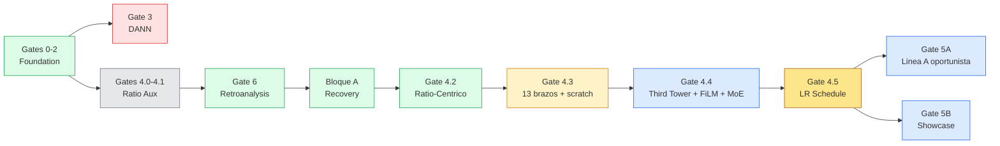

<div align="center">

# Phideus

### Harmonic Information Theory — Research Program


-0A7E3B?style=for-the-badge)

[](https://deepwiki.com/AlterMundi/Phideus)

*Do frequency ratios constitute a universal informational language?*

</div>

---

**Phideus** investiga si los ratios armonicos de frecuencia (3:2, 5:4, 7:4...) funcionan como unidades fisicas de informacion transferibles entre modalidades. El banco de pruebas actual es **Audio <-> MIDI** cross-modal retrieval sobre MAESTRO, con entrenamiento contrastivo (VICReg) y evaluacion estructurada.

> **Foco actual**: **transición a Escalón 2 (Speech <-> EGG)** con Gate 5A mantenido como línea oportunista en paralelo.
> **Corte 2026-03-02 (repo sincronizado)**: **Gate 5B quedó cerrado**. `Test05` permanece como cierre estadístico (`15/15` en `results_unc`) y `Test02` ya cerró `4/4`: `real=83.0%`, `zero=75.0%`, `random=73.6%`, `shuffled=73.6%*`.
> **Lectura multi-seed vigente**: `d4a4=84.1%±2.3pp`, `d4-a4r=81.2%±2.5pp`, `a4r=80.7%±1.9pp`, `D0=75.2%±2.3pp`.
> **Lectura causal vigente de Test02**: con exactamente los mismos `66,217,472` parámetros entrenables, las ablaciones sin información real de descriptor caen a banda `D0` (`73.6-75.0%`). La mejora de `d4a4` es causal y viene del contenido del descriptor, no de capacidad extra.
> **Test13G**: `Phase A` falsó la ruta `z=256 -> piano-roll` (`PR F1≈0.11`) y `13G-B` ya quedó completo: `D0(pool-188)=0.1089`, `d4a4=0.1037`, `a4r=0.1024`. La decodificabilidad pre-pooling resulta genérica y no muestra ventaja para descriptor-arms.
> **Visuales Gate 5B**: paquete validado de `24 PNG` + `6 GIF` en `Documents/01_FRENTES_ACTIVOS/BIAS_CONTROL/resultados_compartir/06_gate5b_scientific_validation/`.
> **Viz reorganization**: homepage interactiva ya quedó reordenada a **12 rutas activas** con módulos específicos por gate/arm.
> **Arquitecturas**: explora las redes del proyecto en visualizaciones 3D interactivas → **[altermundi.github.io/Phideus](https://altermundi.github.io/Phideus/)**

\* `shuffled` convergió y se tomó como cierre operativo en `e20`.

---

## Resultado Principal (Lectura en 60s)

El hallazgo operativo más fuerte hasta este corte es que los descriptores de ratios no solo agregan información: pueden actuar como **lógica de organización atencional**.  
En las variantes `reverse cross-attention` (`Q=descriptor`, `K/V=features`), el modelo organiza mejor qué comparar entre dominios y con qué costo computacional hacerlo.

| Indicador clave | Resultado | Comparación | Evidencia |
|---|---:|---|---|
| Operaciones de atención (rama audio, teórico) | **163x menos** | `2400^2 -> 188^2` en costo `O(N^2)` al comprimir tokens antes del bloque principal | `Documents/01_FRENTES_ACTIVOS/BIAS_CONTROL/RANKING_DESCRIPTORES_UNIFICADO.md` |
| Velocidad de entrenamiento/inferencia | **2.6x más rápido** | `~13 min/ep` (`a4r/d4a4r/d4-a4r`) vs `~34 min/ep` (`D0`) | `Documents/01_FRENTES_ACTIVOS/BIAS_CONTROL/RANKING_DESCRIPTORES_UNIFICADO.md` |
| Recall bidireccional (`S=min(A2M,M2A)`) | **+10.4pp** | `83.8%` (`d4a4`) vs `73.4%` (`D0`) en scoreboard canónico | `data/gate5b_results/{d4a4,D0}/test12_scoreboard.json` |
| Alineamiento representacional cross-modal (CKA) | **+82%** | `0.794` (`d4-a4r`) vs `0.435` (`D0`) en media audio<->MIDI | `data/gate5b_results/{d4-a4r,D0}/test06_rsa_cka.json` |

Nota de rigor:
- El `+10.4pp` corresponde al mejor modelo ratio-guided global (`d4a4`).
- En reverse puro (`a4r`), la mejora de scoreboard es `+8.6pp` (`82.0%` vs `73.4%`).

## Navegacion Rapida (Por Objetivo)

| Si queres... | Ir a |
|---|---|
| Ver el estado ejecutivo y decisiones vigentes | `Documents/00_TRONCAL/Proyecto_Estado_Actual.md` |
| Ver roadmap y próximos pasos de Gate 5B | `Documents/01_FRENTES_ACTIVOS/BIAS_CONTROL/ROADMAP_BIAS_CONTROL.md` |
| Ver resultados científicos del showcase (tests 01/03/04/06/08/09/10/12) | `Documents/01_FRENTES_ACTIVOS/BIAS_CONTROL/11_GATE_5_LINEA_B_SHOWCASE/README.md` |
| Ver el informe completo de Gate 5B | `Documents/01_FRENTES_ACTIVOS/BIAS_CONTROL/11_GATE_5_LINEA_B_SHOWCASE/INFORME_COMPLETO_GATE5B.md` |
| Ver ranking unificado de descriptores y mecanismos | `Documents/01_FRENTES_ACTIVOS/BIAS_CONTROL/RANKING_DESCRIPTORES_UNIFICADO.md` |
| Reproducir experimentos desde scripts | [Reproduccion / Quick Start](#reproduccion--quick-start) |

---

## Glosario

| Termino | Definicion |
|---------|-----------|
| **S** | `min(A2M R@10, M2A R@10)` — metrica canonica de retrieval (mayor = mejor) |
| **R@10** | Recall at 10: fraccion de matches correctos en el top 10 de un pool de 256 |
| **A2M / M2A** | Audio-to-MIDI / MIDI-to-Audio — direccion de retrieval |
| **hard_neg** | Precision distinguiendo un segmento de otra seccion de la *misma pieza* |
| **D0** | Modelo baseline (sin inyeccion de descriptores) |
| **pp** | Percentage points (diferencia absoluta) |
| **VICReg** | Variance-Invariance-Covariance Regularization (loss contrastiva) |

---

## Hipotesis de Investigacion

| Hipotesis | Estado | Evidencia |
|-----------|--------|-----------|
| **H1 — Estructura** | **Validada** | Distribuciones de ratios no aleatorias en multiples tipos de senal |
| **H2 — Aprendibilidad** | **Validada** | Redes neuronales aprenden representaciones compactas de ratios (val_loss < 0.5) |
| **H3 — Cross-modality** | **Prometedor** | Gate 4.3 consolidó `d4a4=69.8%` (+9.6pp) y `d4a4-scratch e30=83.6%`. Gate 4.4 cerró screening de 24 brazos; en runs largos, `t3-wt` y `d4-a4r` empatan en `79.8%` y `moe-dual` llega a `72.6%`. |

---

## Resultados Clave — Gate 4.3: Inyeccion Ratio-Centrica

13 brazos, 5 epochs cada uno desde `foundation_locked_e25.pt`, freeze-policy run-d.
Evaluacion estructurada: pool=256, queries=500, seed=42.

| Rank | Brazo | Descriptor | Mecanismo | Best S | hard_neg | vs D0 |
|------|-------|-----------|-----------|--------|----------|-------|
| **1** | **d4a4** | **MIDI intervals + Audio log-freq** | **Dual same-mod concat** | **69.8%** | **91.6%** | **+9.6pp** |
| 2 | A4r | Audio log-freq deltas (8d) | Reverse cross-att | 68.6% | 91.6% | +8.4pp |
| 3 | D4r | MIDI intervals (4d) | Reverse cross-att | 64.2% | 93.2% | +4.0pp |
| 4 | D4 | MIDI intervals (4d) | Concat | 63.6% | 91.2% | +3.4pp |
| 4 | A4 | Audio log-freq deltas (8d) | Concat | 63.6% | 92.4% | +3.4pp |
| 6 | A4x | Audio log-freq deltas (8d) | Cross-attention | 62.6% | 92.4% | +2.4pp |
| 7 | A7x | Audio rational attractor (12d) | Cross-attention | 62.2% | 92.0% | +2.0pp |
| 8 | D0 | — | Baseline | 60.2% | 90.0% | — |
| 9 | D4x | MIDI intervals (4d) | Cross-attention | 60.0% | 91.4% | -0.2pp |
| 10 | A9 | IDF-weighted attractor (12d) | Concat | 58.8% | 90.4% | -1.4pp |
| 10 | A7 | Audio rational attractor (12d) | Concat | 58.8% | 90.2% | -1.4pp |
| 12 | A8 | Onset-weighted chroma (12d) | Concat | 57.4% | 90.6% | -2.8pp |
| 13 | d4a4cm | MIDI intervals + Audio log-freq | Dual cross-modal | 52.4% | 89.6% | -7.8pp |

**Observaciones** (sin extrapolacion — [directiva analitica](Documents/01_FRENTES_ACTIVOS/BIAS_CONTROL/ROADMAP_BIAS_CONTROL.md)):
- **d4a4 es superaditivo**: D4 solo = +3.4pp, A4 solo = +3.4pp, d4a4 = +9.6pp (no +6.8pp).
- **Reverse cross-att es el mejor mecanismo individual**: A4r = 68.6% con un solo descriptor, casi iguala a d4a4 dual (69.8%).
- **Same-modality >> cross-modal**: d4a4cm (cross-modal injection) destruye senal (-7.8pp).
- **Reverse > forward cross-att**: A4r (+8.4pp) >> A4x (+2.4pp); D4r (+4.0pp) > D4x (-0.2pp).
- **A4/D4 son los mejores descriptores**: A8 y A9 no superan baseline. A7 tampoco.

### d4a4 from-scratch — 30 epochs (COMPLETO)

Mismo punto de partida que D-02 (MERT pretrained + random MIDI). Unica diferencia: inyeccion d4a4.
Duracion: 636 min (10.6h). Best model: epoch 30.

| Epoch | Loss | S | A2M | M2A | hard_neg | MRR | R@1 | mean_rank | vs D-02 best |
|-------|------|---|-----|-----|----------|-----|-----|-----------|--------------|
| 10 | 13.60 | 74.6% | 74.6% | 75.0% | 93.0% | 0.336 | 15.9% | 7.7 | +12.8pp |
| 15 | 13.38 | 65.8% | 65.8% | 68.6% | 91.0% | 0.316 | 16.4% | 10.0 | +4.0pp |
| 20 | 13.26 | 75.6% | 75.6% | 76.8% | 93.6% | 0.370 | 19.0% | 7.0 | +13.8pp |
| 25 | 13.21 | 82.2% | 82.8% | 82.2% | 95.4% | 0.430 | 25.2% | 5.7 | +20.4pp |
| 28 | 13.19 | 82.8% | 82.8% | 83.6% | 94.8% | 0.444 | 26.4% | 5.6 | +21.0pp |
| 29 | 13.19 | 82.6% | 82.6% | 83.8% | 95.2% | 0.443 | 26.3% | 5.4 | +20.8pp |
| **30** | **13.20** | **83.6%** | **84.0%** | **83.6%** | **95.2%** | **0.444** | **25.9%** | **5.4** | **+21.8pp** |

D-02 best = S=61.8% (epoch 25). El modelo seguia mejorando en e30 (no saturado).

---

## Visualizaciones Interactivas de Arquitectura

Exploraciones 3D de las redes neuronales del proyecto:
**[altermundi.github.io/Phideus](https://altermundi.github.io/Phideus/)**

| Visualizacion | Arquitectura | Descripcion |
|--------------|-------------|-------------|
| [Gate 4.3 — D0 Baseline (MERT + MIDI)](https://altermundi.github.io/Phideus/phideus) | Gate 4.3 | Baseline cross-modal completo usado como control del frente |
| [Gate 4.3 — a4r Reverse Cross-Attention](https://altermundi.github.io/Phideus/crossatt) | Gate 4.3 | Reverse cross-attention: el descriptor consulta y organiza las features |
| [Gate 4.3 — d4a4 Concat Injection](https://altermundi.github.io/Phideus/d4a4) | Gate 4.3 | Concat same-modality con A4+D4; record del scoreboard (`S=83.8%`) |
| [Gate 4.3 — d4x-a4x Forward Cross-Attention](https://altermundi.github.io/Phideus/d4x-a4x) | Gate 4.3 | Variante forward cross-attention con matriz de atención grande y simétrica |
| [Gate 4.3 — d4r-a4r Mixed Descriptors + Reverse](https://altermundi.github.io/Phideus/d4r-a4r) | Gate 4.3 | Estrategia mixta: A4 en audio y D4 en MIDI, ambos con reverse cross-att |
| [Gate 5A — T3 Third Tower](https://altermundi.github.io/Phideus/t3) | Gate 5A | Visualización 3-way VICReg con una tercera torre ligera |
| [Gate 4.3 — Bloque A Training Results](https://altermundi.github.io/Phideus/bloquea) | Bloque A | Adapters en capas congeladas + unfreeze parcial |
| [Gate 3 — DANN Adversarial Analysis](https://altermundi.github.io/Phideus/dann) | Gate 3 | Gradient reversal layer para embeddings domain-invariant |
| [HRM Architecture (Research)](https://altermundi.github.io/Phideus/hrm) | HRM | L-Module + H-Module con Adaptive Computation Time |
| [Constellation Tokens (UOEMD)](https://altermundi.github.io/Phideus/constellation) | UOEMD | Tokens sparse de ratios para el frente histórico UOEMD |
| [JEPA-Lite (UOEMD)](https://altermundi.github.io/Phideus/jepa) | UOEMD | Predictor bidireccional con stop-gradient e InfoNCE |
| [Roseta VAE (UOEMD)](https://altermundi.github.io/Phideus/roseta) | UOEMD | VAE dual-domain con factorización shared/private |

> Adaptado de [bbycroft/llm-viz](https://github.com/bbycroft/llm-viz) (MIT).

---

<!-- BELOW THE FOLD -->

<details>
<summary><strong>Roadmap</strong></summary>

### Progresion de Gates



### Matriz de Gates

| Gate | Proposito | Estado | Decision |
|------|----------|--------|----------|
| Gate 0 | Integridad de datos | Completado | GO |
| Gate 1 | Baselines intra-modales | Completado | GO |
| Gate 2 | Foundation baseline | Completado | GO (R@10=34.4%, hard_neg=80.4%) |
| Gate 2.5 | Sonda de separabilidad | Completado | GO (diagnostico) |
| Gate 3 | DANN | **Cerrado** | **NO-GO** (sin mejora robusta) |
| Gate 4.0 | Ratio auxiliary | Completado | Senal mixta |
| Gate 4.1 | Matriz causal | **Cerrado** | **NO-GO** (dS=+0.8pp < umbral) |
| Gate 6 | Retroanalysis | Completado | Causa raiz confirmada (audio encoder congelado) |
| Gate 4.2 | Pre-red dual-domain | **Cerrado** | **NO-GO** (AUC ~0.50) |
| Bloque A | Recovery (S0/A/B/C/D) | Completado | D-02 e25 -> foundation lock |
| **Gate 4.3** | **Ratio re-centrico (13 brazos + scratch)** | **Cerrado** | **d4a4-scratch=83.6% (record 30ep)** |
| Gate 4.4 | Third tower + FiLM + MoE | **Cerrado (screening + 30ep clave)** | Screening 24 brazos cerrado; runs largos t3-wt/moe-dual cerrados |
| Gate 4.5 | LR schedule optimization (50ep/60ep) | **Cierre operativo** | resultados usados para seleccionar checkpoints canónicos de Gate 5B |
| Gate 5A | Conditioned projections + combinatorios oportunistas | Replanteado | linea paralela, no bloqueante para Escalon 2 |
| Gate 5B | Showcase cientifico (13 tests) | **Cerrado** | `Test02` 4/4 cerrado, `Test13G-B` completo y Gate 5B Línea B cerrada |

### TripleScaloneta

| Escalon | Dominio | Estado | Criterio de avance |
|---------|---------|--------|--------------------|
| **1** | MAESTRO Audio <-> MIDI | **Cerrado** (Escalón 1-C) | Gate 5B quedó cerrado; el siguiente foco principal puede pasar a Escalón 2 |
| 2 | Speech <-> EGG | Planificado | Cierre robusto de Escalon 1 |
| 3 | ECG <-> PPG | Proyeccion | Evidencia de generalidad en Escalon 2 |

### Roadmap Visual Interactivo

Roadmap detallado (fuente canónica de estado):
`Documents/01_FRENTES_ACTIVOS/BIAS_CONTROL/ROADMAP_BIAS_CONTROL.md`.

</details>

<details>
<summary><strong>Arquitectura</strong></summary>

### Foundation Model (Run D)

```
Audio (waveform 96kHz x 4s) -> MERTEncoderLite (4 CNN + 4 Transformer, d=1024) -> MLP -> [B, 256]
MIDI  (event sequence)      -> 4x Transformer (d=512)                          -> MLP -> [B, 256]
                                        VICReg Loss (inv=10, var=10, cov=1)
```

| Componente | Parametros | Detalles |
|-----------|-----------|---------|
| Audio encoder | ~60M | 4 CNN stages + 4 Transformer layers, output d=1024 |
| MIDI encoder | ~13M | 4 Transformer layers, d=512 |
| Proyecciones | ~0.5M | Audio: 1024->512->256, MIDI: 512->512->256 |
| d4a4 inyeccion | ~1.3M | interval_projection (516->512+LN) + audio_descriptor_projection (1032->1024+LN) |
| Foundation | bloqueado | `foundation_locked_e25.pt` (MD5: ddb2ebf7, chmod 444) |

### Descriptores de Ratios (Gate 4.3)

**D4 — MIDI intervals** (4d por token): pitch diff, IOI, velocity diff, duration ratio.
Computado desde eventos MIDI. Inyectado post-embedding, pre-Transformer.

**A4 — Audio log-frequency deltas** (8d por frame): 8 bandas log-freq, delta temporal, normalizado.
Computado desde STFT (n_fft=2048, hop=512). Inyectado post-CNN, pre-Transformer.

**A7 — Rational attractor** (12d por frame): asignacion suave de ratios pairwise de picos a 12 atractores de afinacion justa.
Testea la hipotesis Phideus directamente: la proximidad a ratios JI (3:2, 5:4, etc.) lleva senal cross-modal?

**Mecanismos de inyeccion testeados**: concat (proyeccion lineal), cross-attention (Q=features, K/V=descriptor), reverse cross-attention (Q=descriptor, K/V=features, con compresion de tokens `2400 -> 188`: ~12.8x menos tokens y ~163x menos operaciones teóricas de self-attention), dual (ambos encoders).

</details>

<details>
<summary><strong>Foundation Training — Bloque A</strong></summary>

### Comparacion de Estrategias de Fine-Tuning

| Run | Estrategia | Best S | Best Epoch | hard_neg |
|-----|-----------|--------|------------|----------|
| S0 | Eval-only (control) | 34.4% | — | 80.4% |
| A | Adapters only | 30.0% | 5 | 76.8% |
| B | Unfreeze capas 2-3 | 43.2% | 3 | 85.2% |
| C | Hibrido (adapters 0-1 + unfreeze 2-3) | 49.4% | 5 | 88.4% |
| D | Full unfreeze (split-LR) | 51.0% | 5 | 89.2% |
| **D-02** | **Full unfreeze, 30 epochs** | **61.8%** | **25** | **90.4%** |

D-02 epoch 25 fue bloqueado como `foundation_locked_e25.pt` — punto de partida para todos los brazos de Gate 4.3.

</details>

<details>
<summary><strong>Reproduccion / Quick Start</strong></summary>

### Setup del Entorno

```bash
python3 -m venv venv
source venv/bin/activate
pip install -r requirements.txt
```

### Pipeline Completo

```bash
python experiments/bias_control/run_all_gates.py \
  --maestro-dir data/maestro_v3/maestro-v3.0.0 \
  --output data/bias_control_medium
```

### Gate 4.3 (ejemplo: brazo d4a4)

```bash
PYTORCH_CUDA_ALLOC_CONF=expandable_segments:True \
python experiments/bias_control/gate42_training.py \
  --descriptor d4a4 \
  --checkpoint data/bias_control_medium/training_outputs/foundation_locked_e25.pt \
  --output data/bias_control_medium/training_outputs/gate43/d4a4 \
  --maestro-dir data/maestro_v3/maestro-v3.0.0 \
  --epochs 5 --batch-size 16 --num-workers 8 \
  --freeze-policy run-d --seed 42 --device cuda
```

### Evaluacion Estructurada

```bash
python experiments/bias_control/evaluate_structured_pool.py \
  --model <checkpoint.pt> \
  --output <output.json> \
  --pool-size 256 --n-queries 500 --seed 42 \
  --maestro-dir data/maestro_v3/maestro-v3.0.0
```

**Protocolo canonico**: pool=256, queries=500, seed=42.

</details>

<details>
<summary><strong>Experimentos Anteriores</strong></summary>

### Escalon 1 — MAESTRO Hashing (pausado)

Identificacion cross-modal basada en hashing. Route B alcanzo 80% piece accuracy (N=10), pero la resolucion temporal del onset limita el escalado.

| Experimento | Route A | Route B | vs Random |
|-----------|---------|---------|-----------|
| N=10 (corregido) | 42.5% | 32.9% | 4.2x / 3.3x |
| N=20 (replicacion) | 26.6% | 21.4% | 5.3x / 4.3x |

### UOEMD Revisionismo (cerrado — NO-GO)

Dual-domain (Audio <-> Vibracion) con 128 muestras. Multiples enfoques testeados (histogramas, constellation tokens, JEPA-lite). Dataset insuficiente para validar H3.

### Resumen Experimental

| Bloque | Resultado | Lectura |
|--------|-----------|---------|
| Escalon 1 hashing | 27% piece accuracy | Senal detectada, insuficiente para cierre robusto |
| UOEMD revisionismo (F0-F3A) | NO-GO | Confirmados limites de dataset/regimen |
| BIAS_CONTROL Gate 2 | Gap 0.478, R@10=34.4% | Baseline operativo |
| BIAS_CONTROL Gate 3 (DANN) | 4 runs, sin mejora | Invariancia modal no era el cuello |
| BIAS_CONTROL Gate 4.0-4.1 | Mixto -> cerrado | Control causal insuficiente |
| BIAS_CONTROL Gate 6 + 4.2 | Diagnostico completado | Causa raiz: audio encoder congelado |
| **BIAS_CONTROL Gate 4.3** | **13 brazos; d4a4=69.8%, A4r=68.6% (5ep); scratch=83.6% (30ep)** | **Inyeccion de ratios funciona, superaditiva. Reverse cross-att mejor mecanismo individual.** |
| **BIAS_CONTROL Gate 4.4** | **24 brazos cerrados (incl. MoE v2/v3/v4) + 2 runs largos extra** | **Third Tower (t3-wt) gana familia 4.4; FiLM/MoE en banda 58-60% a 5ep.** |
| **BIAS_CONTROL Gate 4.5** | **LR schedule optimization en curso (60ep/50ep)** | **stretched/hold cerrados; `a4r ctail=80.6` completo; `D0/d4a4 ctail` en curso y `d4-a4r ctail` re-submit.** |
| **Runs largos scratch (30ep)** | **d4a4 83.6 > a4r 82.0 > d4-a4r/t3-wt 79.8 > d4a4r 74.4 > moe-dual 72.6** | **Referencia cerrada para comparar Gate 4.5.** |

### Hallazgos Metodologicos

1. **La metrica canonica debe ser structured pool**, no solo metricas globales de validacion.
2. **Forzar invariancia (DANN) puede destruir senal de retrieval** si la hipotesis causal no esta bien acotada.
3. **Comparabilidad de regimen** (pool, seed, batch budget) es critica para decisiones correctas.

</details>

<details>
<summary><strong>Documentacion</strong></summary>

### Documentos Principales

| Documento | Descripcion |
|----------|------------|
| [ROADMAP_BIAS_CONTROL.md](Documents/01_FRENTES_ACTIVOS/BIAS_CONTROL/ROADMAP_BIAS_CONTROL.md) | Plan maestro y criterios de decision |
| [INDEX_BIAS_CONTROL.md](Documents/01_FRENTES_ACTIVOS/BIAS_CONTROL/INDEX_BIAS_CONTROL.md) | Navegacion por fases y arbol documental |
| [Proyecto_Estado_Actual.md](Documents/00_TRONCAL/Proyecto_Estado_Actual.md) | Estado ejecutivo del proyecto |
| [INDICE_DOCUMENTACION.md](Documents/00_TRONCAL/INDICE_DOCUMENTACION.md) | Mapa completo de documentacion |

### Documentacion por Gate

| Gate | Documento |
|------|----------|
| Gate 2 | [INFORME_GATE2_COMPLETO.md](Documents/01_FRENTES_ACTIVOS/BIAS_CONTROL/01_GATES_0_2_5/GATE_2_FOUNDATION/INFORME_GATE2_COMPLETO.md) |
| Gate 3 | [INFORME_GATE3_COMPLETO.md](Documents/01_FRENTES_ACTIVOS/BIAS_CONTROL/02_GATE_3_DANN/INFORME_GATE3_COMPLETO.md) |
| Diagnostico | [INFORME_DEC005_DIAGNOSTICO_COMPLETO.md](Documents/01_FRENTES_ACTIVOS/BIAS_CONTROL/04_DIAGNOSTICO_GATE_6_Y_GATE_4_2/INFORME_DEC005_DIAGNOSTICO_COMPLETO.md) |
| Bloque A | [PLAN_EJECUCION_POST_DEC005_v1.1.md](Documents/01_FRENTES_ACTIVOS/BIAS_CONTROL/05_PLAN_POST_DIAGNOSTICO_BLOQUE_A/PLAN_EJECUCION_POST_DEC005_v1.1.md) |
| Gate 4.2 | [plan_gate_4.2.md](Documents/01_FRENTES_ACTIVOS/BIAS_CONTROL/06_GATE_4_2_RATIO_CENTRICO/plan_gate_4.2.md) |
| Gate 4.4 | [README.md](Documents/01_FRENTES_ACTIVOS/BIAS_CONTROL/08_GATE_4_4_ARQUITECTURAS_MAYORES/README.md) |
| Gate 4.5 | [README.md](Documents/01_FRENTES_ACTIVOS/BIAS_CONTROL/09_GATE_4_5_LR_SCHEDULE_OPTIMIZATION/README.md) |
| Gate 5A | [README.md](Documents/01_FRENTES_ACTIVOS/BIAS_CONTROL/10_GATE_5_LINEA_A_BARRIDO/README.md) |
| Gate 5B | [README.md](Documents/01_FRENTES_ACTIVOS/BIAS_CONTROL/11_GATE_5_LINEA_B_SHOWCASE/README.md) |

### Estructura del Repositorio

```
Phideus/
├── src/bias_control/          # Modulos core (encoders, losses, descriptors)
├── experiments/bias_control/  # Scripts de training, evaluacion, gates
├── Documents/
│   ├── 00_TRONCAL/            # Documentos ejecutivos
│   ├── 01_FRENTES_ACTIVOS/    # Frentes activos (BIAS_CONTROL, ESCALON_1)
│   ├── 02_FRENTES_PAUSADOS/   # Pausados (VibeTensor)
│   ├── 03_FRENTES_CERRADOS/   # Cerrados (UOEMD)
│   └── 04_TRANSVERSAL/        # Transversal (teoria, visualizaciones)
├── viz/                       # Visualizaciones WebGL interactivas (Next.js)
├── data/                      # Datasets y outputs (no en git)
└── config/                    # Configuraciones
```

> `data/`, `models/`, `train/` y otros artefactos pesados no se versionan.

</details>

---

> *"El bosque ya canta. Nuestra tarea es entender su afinacion."*

**Licencia**: MIT — ver [LICENSE.md](LICENSE.md)
